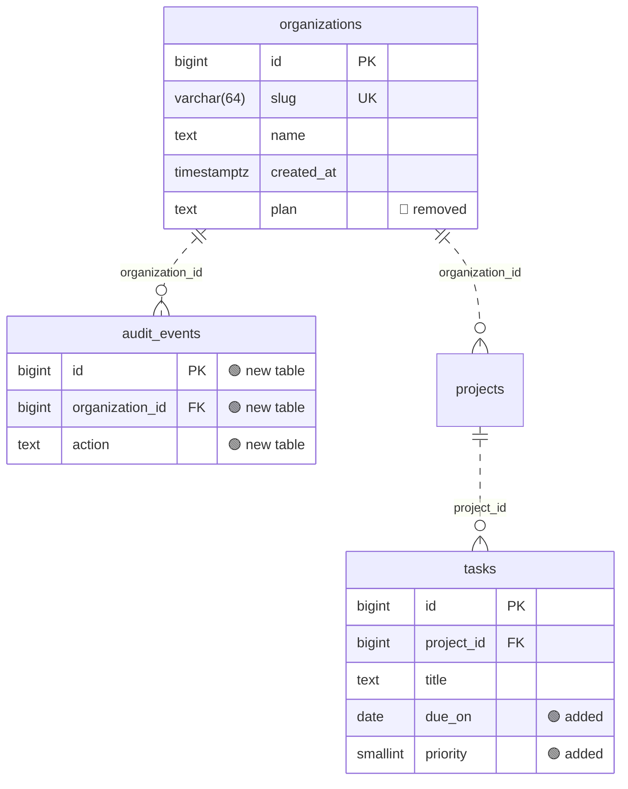

# Diagram Regenerator

[](https://github.com/ag2502/Diagram-Regenerator/actions/workflows/ci.yml)

**Always-current database schema diagrams, schema-change review on every pull request,
and alerts when dev, staging and prod drift apart.**

ER diagrams go stale the moment they're drawn, and teams usually learn about schema drift
or undocumented columns when something breaks. Diagram Regenerator reads your schema from
where it already lives (migration files, a live database or your ORM models) and keeps
three things true:

- **The diagram is never out of date.** A Mermaid ER diagram and data dictionary are
  regenerated on every merge and committed next to your code, where GitHub renders them.
- **Every schema change is reviewed.** Pull requests get one comment that rates each change
  (🔴 breaking · 🟠 warning · 🟢 safe · ⚪ info) and draws the changed tables. The check
  can fail on breaking changes.
- **Environments can't drift silently.** A scheduled job compares each database with the
  migrations and posts to Slack when they disagree.

It also drafts missing column descriptions, with Claude or offline heuristics, into a file
your team reviews.

<details open><summary><b>What a pull request sees</b> (real output for <a href="examples/quickstart">the quickstart example</a>)</summary>

| | Change | Detail |
| --- | --- | --- |
| 🟢 | Table `audit_events` added | |
| 🔴 | Column `organizations.plan` removed | was text not null default 'free'<br>_its data is dropped and queries using it fail_ |
| 🟢 | Column `tasks.due_on` added | date |
| 🟢 | Column `tasks.priority` added | smallint not null default 2 |



_(Diagram trimmed for this page; the [full comment](examples/quickstart/sample-pr-comment.md) shows every column.)_

</details>

## Install once, use in every project

Diagram Regenerator is a command-line tool, like Prettier or Black: install it once and the
`diagram-regen` command works in every project folder. With [uv](https://docs.astral.sh/uv/):

```bash
uv tool install "diagram-regenerator[postgres,mysql,llm] @ git+https://github.com/ag2502/Diagram-Regenerator@v0.1.1"
diagram-regen --version
```

`pipx install "…same text…"` works the same way. The extras are optional: `postgres` and
`mysql` add database drivers, `llm` adds Claude-drafted descriptions. SQL migration files and
SQLite need no extras. Python 3.10 or newer.

- **Upgrade:** run the install command again with the new tag (`@v0.1.2`, …) and `--force`.
- **Uninstall:** `uv tool uninstall diagram-regenerator`.
- **Teammates and CI:** nothing to install; the GitHub Action (step 5 below) runs it for them.

## Step-by-step: add it to your project

**1. Go to the project.**

```bash
cd ~/code/my-app
```

**2. Create the config.** `init` looks for your schema and its SQL dialect and writes a
commented `diagram-regen.toml`:

```bash
diagram-regen init
```

It finds migration folders (`prisma/migrations`, `db/migrations`, `migrations`,
`supabase/migrations`, Flyway's `src/main/resources/db/migration`, …) and schema files
(`schema.sql`, `db/structure.sql`). If it finds nothing, or the wrong thing, set `source` in
`diagram-regen.toml` yourself:

| Your project keeps its schema in… | Set `source` to |
| --- | --- |
| SQL migration files | `"db/migrations"` (the folder) |
| One schema file, e.g. Supabase's SQL editor script | `"schema.sql"` |
| A SQLite file | `"sqlite:///data/app.db"` |
| A database (Django, Alembic, Rails, Knex…) | `"${DATABASE_URL}"`, read from the environment |
| SQLAlchemy models | `"python:myapp.models:Base"` |

**3. Generate the docs.**

```bash
diagram-regen generate
```

This writes `docs/schema/README.md` (the diagram and a table per database table) and
`docs/schema/schema.json` (the snapshot later changes are compared against). Any warnings
point at the exact `file:line` that couldn't be read.

**4. Look at it.** GitHub draws the diagram as soon as you push. To see it locally, add
`html = "docs/schema/index.html"` under `[output]` in the config, run `generate` again, then
`open docs/schema/index.html`. VS Code's Markdown preview shows the diagram only with a
Mermaid extension.

**5. Commit it, and let GitHub keep it current.**

```bash
diagram-regen init-ci            # writes .github/workflows/schema-docs.yml
git add diagram-regen.toml docs/schema .github
git commit -m "Add database schema docs"
git push
```

From now on, every pull request that touches the schema gets a comment rating each change,
and every merge to `main` regenerates the docs. The workflow requests the permissions it
needs; if your organization limits Actions to read-only tokens, an admin has to allow write
access. If `main` only accepts changes through pull requests, set `commit: false` on the
update step and run `diagram-regen generate` in your branches instead.

**6. Day to day.** After writing a migration:

```bash
diagram-regen diff       # what does it change, and is any of it breaking?
diagram-regen generate   # update the docs (or let the merge do it)
```

Optional extras, in any order:

- `diagram-regen describe` drafts column descriptions into `docs/schema/descriptions.yml`
  for you to review (`--provider heuristic` works offline; Claude needs `ANTHROPIC_API_KEY`).
- Add `[environments]` to the config and run `diagram-regen drift` to compare live databases
  with your migrations (`diagram-regen init-ci --drift` schedules it with Slack alerts).
- Add the [pre-commit hook](#pre-commit) to regenerate the docs on every commit.

### Projects with more than one database

Give each database its own config file and output folder, and pass it with `-c`. For
example, a Supabase app schema plus a local SQLite crawler database:

```toml
# diagram-regen.toml (picked up automatically)
source = "schema.sql"
dialect = "postgresql"
```

```toml
# diagram-regen.crawler.toml
source = "sqlite:///data/crawler.db"
descriptions = "docs/crawler-schema/descriptions.yml"

[output]
snapshot = "docs/crawler-schema/schema.json"
markdown = "docs/crawler-schema/README.md"
title = "Crawler database"
```

```bash
diagram-regen generate                              # the app schema
diagram-regen generate -c diagram-regen.crawler.toml  # the crawler database
```

For a quick look without any config: `diagram-regen render sqlite:///data/crawler.db -f html -o crawler.html`.

## Where the schema comes from

Every command accepts the same *source* strings, so you can point any of them at anything:

| Source | Example | Notes |
| --- | --- | --- |
| Migrations folder | `db/migrations` | Replayed in order, **no database needed**. Prisma, Flyway, golang-migrate, sqlx, diesel, dbmate, goose and sql-migrate layouts; down migrations skipped |
| DDL file | `schema.sql`, `db/structure.sql` | e.g. a `pg_dump --schema-only` |
| Live database | `postgresql://…`, `mysql://…`, `sqlite:///app.db` | Any SQLAlchemy URL; reads the catalogue only. `postgres://` URLs from hosting dashboards work |
| SQLAlchemy models | `python:myapp.models:Base` | Also Flask-SQLAlchemy `db` and SQLModel |
| Snapshot | `docs/schema/schema.json` | What `generate` writes |
| Environment | `env:prod` | A URL from `[environments]` in the config |
| Git ref | `git:origin/main`, `git:v1.2:db/migrations` | The snapshot (or migrations) at that ref, no checkout needed |

Dialects: PostgreSQL (default), MySQL/MariaDB, SQLite, SQL Server; set `dialect` in the
config. Alembic, Django, Rails and other code-based migrations: run them against a
throwaway database in CI and point the source at it, or use your SQLAlchemy models.

## Everyday commands

| Command | What it does |
| --- | --- |
| `diagram-regen generate` | Rewrite the configured outputs; prints what changed since the last snapshot |
| `diagram-regen check` | Exit 1 if the committed docs are stale (for CI and pre-commit) |
| `diagram-regen diff [OLD] [NEW]` | Rate the changes between two sources. Defaults: committed snapshot → current migrations. `-f text\|markdown\|json`, `--fail-on breaking\|warning\|any\|never` |
| `diagram-regen drift` | Compare every environment with the baseline; `--slack` to alert |
| `diagram-regen describe` | Draft missing descriptions (`--provider claude` or `heuristic`) |
| `diagram-regen render SOURCE -f FORMAT` | One-off render of anything: `mermaid`, `markdown`, `dbml`, `html`, `json` |
| `diagram-regen init` / `init-ci` | Write the config / the GitHub workflows |

Useful one-liners:

```bash
diagram-regen diff git:origin/main                 # what does my branch change?
diagram-regen diff env:staging env:prod            # how do two databases differ?
diagram-regen render "$DATABASE_URL" -f html -o schema.html && open schema.html
diagram-regen render db/migrations -f dbml         # paste into dbdiagram.io
```

## Outputs

`generate` writes whichever of these you configure (the first two by default):

- **`schema.json`**, the snapshot: deterministic (sorted, no timestamps), so it only changes
  when the schema does. Commit it; pull requests are compared against it.
- **`README.md`**: a Mermaid ER diagram plus a linked data dictionary (types, nullability,
  defaults, keys, indexes, "referenced by", enums, descriptions). GitHub renders it in place.
  Big schemas stay legible: the overview drops to key columns after 25 tables and to boxes
  after 60, and `[groups]` adds a focused diagram per area.
- **`index.html`**: a single-file browser with search, zoom and a per-table neighbourhood view.
- **`schema.dbml`** for [dbdiagram.io](https://dbdiagram.io), and **`schema.mmd`** (raw Mermaid).

See [examples/quickstart/docs/schema](examples/quickstart/docs/schema/README.md) for a full page.

## GitHub Action

`diagram-regen init-ci` writes this for you:

```yaml
# .github/workflows/schema-docs.yml
on:
  pull_request:
    paths: ["db/migrations/**", "diagram-regen.toml"]
  push:
    branches: [main]
    paths: ["db/migrations/**", "diagram-regen.toml"]
permissions:
  contents: write        # commit regenerated docs on main
  pull-requests: write   # comment on PRs
jobs:
  schema:
    runs-on: ubuntu-latest
    steps:
      - uses: actions/checkout@v4
        with:
          fetch-depth: 0
      - uses: ag2502/Diagram-Regenerator@v0.1.1
        with:
          mode: ${{ github.event_name == 'pull_request' && 'pr' || 'update' }}
```

| Mode | Use on | Does |
| --- | --- | --- |
| `pr` | `pull_request` | Diffs the branch against its base, posts **one** comment and edits it on later pushes, writes the job summary, fails at `fail-on` severity |
| `update` | `push` to main | Regenerates the docs and commits them (`commit-user-name`, `commit-user-email`, `commit-message` with `{datetime}` `{date}` `{summary}` placeholders) |
| `drift` | `schedule` | Compares environments, writes the job summary, alerts `slack-webhook` |
| `check` | anything | Fails when committed docs are stale |

Other inputs: `config`, `working-directory`, `base`, `fail-on`, `comment`, `extras`
(`postgres,mysql,llm`), `python-version`. Outputs: `changed`, `breaking`, `drift`, `summary`,
`commit`. Pull requests from forks get a read-only token, so they get the job summary
instead of a comment. A scheduled drift job (`diagram-regen init-ci --drift`):

```yaml
      - uses: ag2502/Diagram-Regenerator@v0.1.1
        with:
          mode: drift
          extras: postgres
          slack-webhook: ${{ secrets.SLACK_WEBHOOK_URL }}
        env:
          STAGING_DATABASE_URL: ${{ secrets.STAGING_DATABASE_URL }}
          PROD_DATABASE_URL: ${{ secrets.PROD_DATABASE_URL }}
```

Not on GitHub? The same steps are plain commands: `diagram-regen ci pr`, `ci update --commit
--push`, `ci drift --slack`.

## How changes are rated

| Rating | Examples | Why |
| --- | --- | --- |
| 🔴 breaking | table or column dropped or renamed, narrowing type change, `SET NOT NULL`, new NOT NULL column without a default, primary key change, enum value removed | running code or existing data can fail or be lost |
| 🟠 warning | foreign key or unique index added, index dropped, column now nullable, `ON DELETE` changed | can fail on existing data or change behaviour |
| 🟢 safe | table added, nullable or defaulted column added, widening type change (`int`→`bigint`, `varchar(50)`→`varchar(255)`, `numeric(10,2)`→`numeric(12,2)`), index added | additive |
| ⚪ info | defaults, descriptions, column order | documentation only |

Renames are detected when a dropped and an added column are identical apart from the name.
Generated constraint names are ignored, and types and defaults are normalised (`SERIAL`,
`int4`, `TINYINT(1)`, `::casts`, `now()`), so a schema read from migrations compares
cleanly with one read from a live database. Tune with `[diff] ignore = ["defaults", …]`.

## Drift between environments

```toml
[environments]
staging = "${STAGING_DATABASE_URL}"
prod = "${PROD_DATABASE_URL}"
```

```text
$ diagram-regen drift
Schema drift against db/migrations

                       staging  prod
customers.email        ✓        varchar(320)
orders.discount_cents  missing  ✓
tmp_fix                ✓        extra table

2 of 2 environments differ from db/migrations: staging (1 difference), prod (2 differences)
```

The baseline is the migrations (what the code expects) unless `[drift] baseline` names an
environment. Unreachable databases are reported, not fatal. Use read-only database users.

## Column descriptions

Descriptions live in `docs/schema/descriptions.yml`, a dbt-style file your team edits and
reviews like code. Database comments (`COMMENT ON …`, SQLAlchemy `comment=`/`doc=`) are
used too; the file wins.

```bash
diagram-regen describe                          # Claude drafts missing descriptions
diagram-regen describe --provider heuristic     # offline, from naming conventions
```

Drafts are written as `"[draft] …"` and never overwrite a description a person wrote or a
database comment; the docs mark them until someone deletes the prefix. Claude drafting
(`pip install 'diagram-regenerator[llm]'`, `ANTHROPIC_API_KEY`) sends one request per table
with the table's columns, keys and neighbours, and uses `claude-opus-5-5` unless
`[llm] model` says otherwise. **No row data is sent** unless you pass `--samples N`; even
then values are truncated, and emails, phone numbers, token-like strings and columns named
like secrets are masked first.

## Configuration

Everything is optional; `diagram-regen init` writes a commented starting point. The same
keys work under `[tool.diagram-regen]` in `pyproject.toml`. Paths are relative to the
config file, and `${VAR}` / `${VAR:-default}` are expanded only when a value is used, so
credentials never need to be in the file.

```toml
source = "db/migrations"           # or a URL, a .sql file, python:pkg.models:Base
dialect = "postgresql"             # postgresql | mysql | sqlite | mssql
schemas = []                       # database schemas to read (live databases); ["*"] = all
include = []                       # table globs to keep (default: all)
exclude = ["tmp_*"]                # table globs to drop; migration-tool tables are always skipped
descriptions = "docs/schema/descriptions.yml"

[output]
snapshot = "docs/schema/schema.json"
markdown = "docs/schema/README.md"
html = "docs/schema/index.html"    # optional
dbml = "docs/schema/schema.dbml"   # optional
mermaid = ""                       # optional
title = "Database schema"
diagram = "auto"                   # auto | all | keys | none (overview detail)
layout = ""                        # "elk" for Mermaid's ELK layout
source_label = ""                  # how docs name the source, e.g. "Production"

[groups]                           # extra focused diagrams
Billing = ["invoice*", "payment*"]

[diff]
fail_on = "breaking"               # breaking | warning | any | never
ignore = []                        # comments, defaults, indexes, foreign_keys, enums, column_order

[environments]
prod = "${PROD_DATABASE_URL}"

[drift]
baseline = "source"                # or an environment name
ignore = ["comments", "column_order"]

[notify]
slack_webhook = "${SLACK_WEBHOOK_URL}"

[llm]
model = "claude-opus-5-5"
```

## pre-commit

```yaml
- repo: https://github.com/ag2502/Diagram-Regenerator
  rev: v0.1.1
  hooks:
    - id: diagram-regen-generate   # or diagram-regen-check
```

## Python API

```python
from diagram_regenerator.diff import diff_schemas
from diagram_regenerator.render import render_mermaid
from diagram_regenerator.report import format_text
from diagram_regenerator.sources import load_source

old = load_source("docs/schema/schema.json")
new = load_source("db/migrations", dialect="postgresql")
print(render_mermaid(new))
print(format_text(diff_schemas(old, new)))
```

## Demos

- [examples/quickstart](examples/quickstart): a nine-table SaaS schema with every output,
  reviewed descriptions and a sample PR comment.
- [examples/oss](examples/oss): **Umami, Atuin and Hoppscotch**, 70 real migrations
  replayed without warnings. Umami's rebuilt schema matches its own `schema.prisma`
  exactly (26 tables, 229 columns).

## Limitations

- The SQL replayer models tables, columns, keys, indexes, comments and enums. Views,
  triggers, functions, partitions and row-level security are skipped, and `DO $$ … $$`
  blocks that create tables are reported but not applied. Anything it can't apply is
  reported with `file:line`.
- Code-based migrations (Alembic, Django, Rails, Knex, TypeORM) aren't parsed. Use a
  database the migrations ran against, or SQLAlchemy models.
- Rename detection is a heuristic; a rename is still rated breaking either way.
- Mermaid has no per-entity colours on GitHub, so the visual diff marks changes in
  attribute labels.

## Development

```bash
pip install -e ".[dev]"
pytest                                  # unit + CLI + git + SQLite tests
ruff check . && ruff format --check .
```

Live-database tests replay migrations into real servers and require zero diff against the
parsed result. They run in CI on PostgreSQL 16 and MySQL 8.4, and locally with
`DR_TEST_POSTGRES_URL` / `DR_TEST_MYSQL_URL` or an embedded server (`pip install pgserver`).
CI also renders every committed Mermaid diagram with the official Mermaid CLI and runs the
action against the quickstart example.

## License

[MIT](LICENSE) © Amogh Gaikwad
