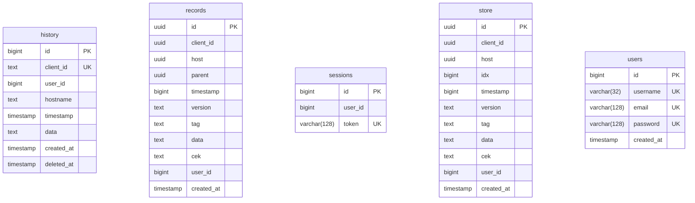

<!-- Generated by diagram-regenerator. Edit descriptions, not this file. -->
# Atuin sync server database (generated demo)

**5 tables · 38 columns** · source `atuinsh/atuin@d440a2e crates/atuin-server/src/db/postgres/migrations` · fingerprint `6633fbafb49d`

> Regenerate with `diagram-regen generate`. Column descriptions come from database comments and the descriptions file; rows marked _draft_ were suggested automatically and await review.

## Contents

- [Entity-relationship diagram](#entity-relationship-diagram)
- [Tables](#tables): [history](#history) · [records](#records) · [sessions](#sessions) · [store](#store) · [users](#users)
- [Enums](#enums)

## Entity-relationship diagram

## Tables

### history

| Column | Type | Nullable | Default | Keys | Description |
| --- | --- | --- | --- | --- | --- |
| `id` | `bigint` |  | auto-increment | PK |  |
| `client_id` | `text` |  |  | UK |  |
| `user_id` | `bigint` |  | auto-increment |  |  |
| `hostname` | `text` |  |  |  |  |
| `timestamp` | `timestamp` |  |  |  |  |
| `data` | `text` |  |  |  |  |
| `created_at` | `timestamp` |  | `current_timestamp` |  |  |
| `deleted_at` | `timestamp` | yes |  |  |  |

**Indexes:** unique `history_client_id_key` (`client_id`) · `history_deleted_index` (`client_id`, `user_id`, `deleted_at`)

### records

| Column | Type | Nullable | Default | Keys | Description |
| --- | --- | --- | --- | --- | --- |
| `id` | `uuid` |  |  | PK |  |
| `client_id` | `uuid` |  |  |  |  |
| `host` | `uuid` |  |  |  |  |
| `parent` | `uuid` | yes |  |  |  |
| `timestamp` | `bigint` |  |  |  |  |
| `version` | `text` |  |  |  |  |
| `tag` | `text` |  |  |  |  |
| `data` | `text` |  |  |  |  |
| `cek` | `text` |  |  |  |  |
| `user_id` | `bigint` |  |  |  |  |
| `created_at` | `timestamp` |  | `current_timestamp` |  |  |

### sessions

| Column | Type | Nullable | Default | Keys | Description |
| --- | --- | --- | --- | --- | --- |
| `id` | `bigint` |  | auto-increment | PK |  |
| `user_id` | `bigint` | yes | auto-increment |  |  |
| `token` | `varchar(128)` |  |  | UK |  |

**Indexes:** unique `sessions_token_key` (`token`)

### store

| Column | Type | Nullable | Default | Keys | Description |
| --- | --- | --- | --- | --- | --- |
| `id` | `uuid` |  |  | PK |  |
| `client_id` | `uuid` |  |  |  |  |
| `host` | `uuid` |  |  |  |  |
| `idx` | `bigint` |  |  |  |  |
| `timestamp` | `bigint` |  |  |  |  |
| `version` | `text` |  |  |  |  |
| `tag` | `text` |  |  |  |  |
| `data` | `text` |  |  |  |  |
| `cek` | `text` |  |  |  |  |
| `user_id` | `bigint` |  |  |  |  |
| `created_at` | `timestamp` |  | `current_timestamp` |  |  |

**Indexes:** unique `record_uniq` (`user_id`, `host`, `tag`, `idx`)

### users

| Column | Type | Nullable | Default | Keys | Description |
| --- | --- | --- | --- | --- | --- |
| `id` | `bigint` |  | auto-increment | PK |  |
| `username` | `varchar(32)` |  |  | UK |  |
| `email` | `varchar(128)` |  |  | UK |  |
| `password` | `varchar(128)` |  |  | UK |  |
| `created_at` | `timestamp` |  | `current_timestamp` |  |  |

**Indexes:** unique `users_email_key` (`email`) · unique `email_unique_idx` (`lower(email)`) · unique `username_unique_idx` (`lower(username)`) · unique `users_password_key` (`password`) · unique `users_username_key` (`username`)

## Enums

| Enum | Values |
| --- | --- |
| `event_type` | `create`, `delete` |
