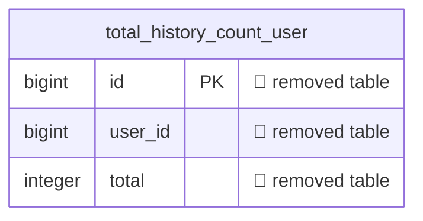

### 🗺️ atuin: what `20260828000000_drop-history-count-trigger.sql` changes

**1 change across 1 table** · 🔴 1 breaking

> [!WARNING]
> 1 change can break running code or lose data. Check the deploy order (expand → migrate → contract).

| | Change | Detail |
| --- | --- | --- |
| 🔴 | Table `total_history_count_user` removed | _3 columns and their data are dropped_ |

Diagram of the changed tables

🟢 added · 🔴 removed · 🟡 changed · unmarked columns are unchanged

Generated by `python examples/oss/build.py` from [atuinsh/atuin@d440a2e](https://github.com/atuinsh/atuin/tree/d440a2e616825533d3eee0db2af7d22d68dcc5c2/crates/atuin-server/src/db/postgres/migrations): the schema before `20260828000000_drop-history-count-trigger.sql` compared with the schema after it.
