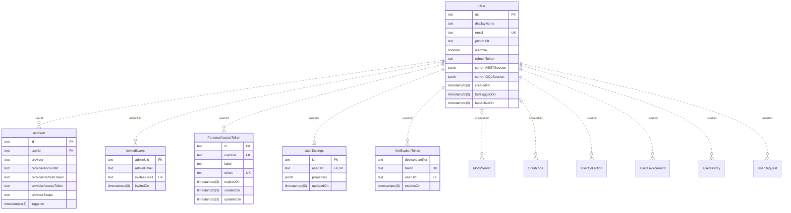
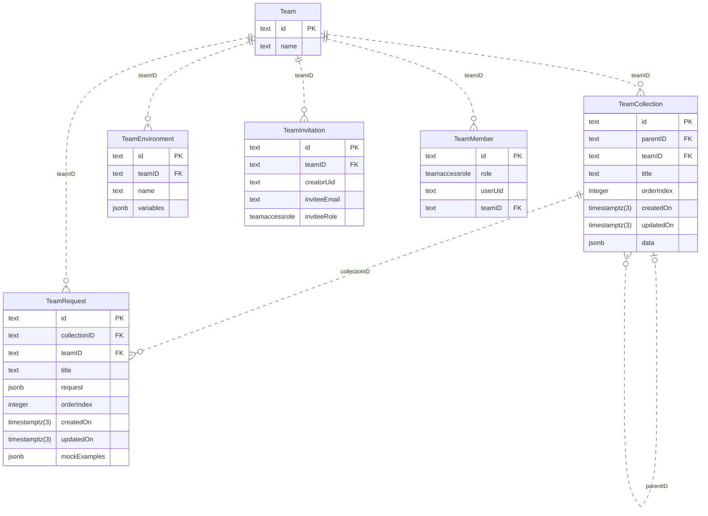
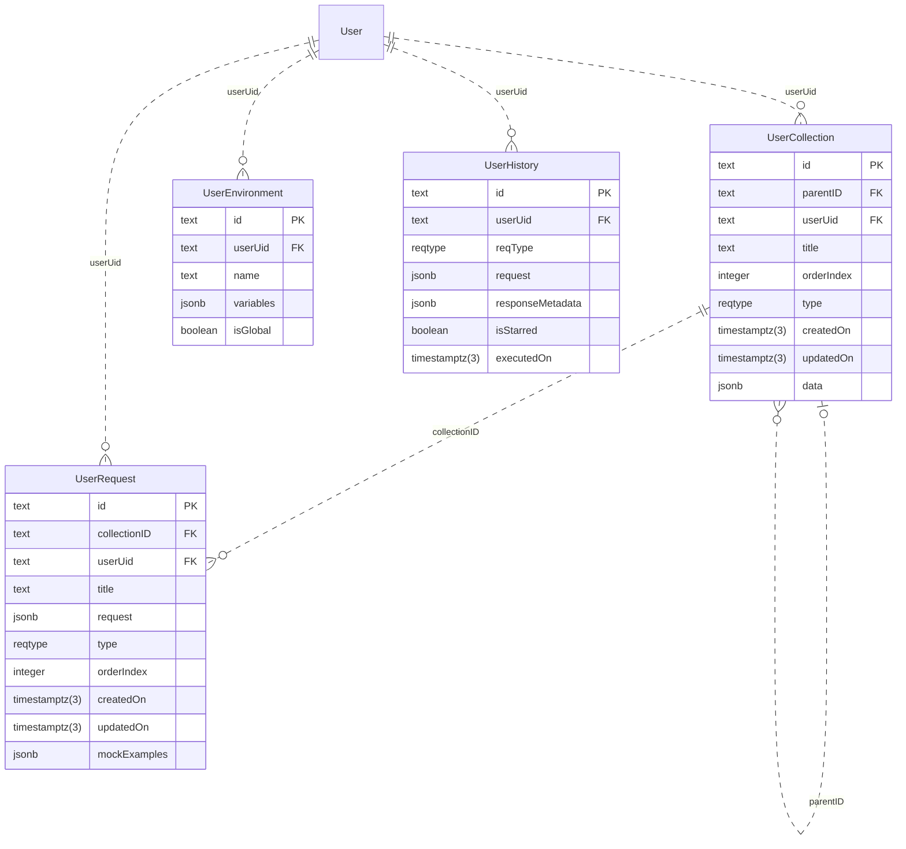
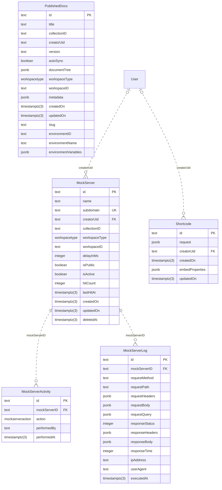
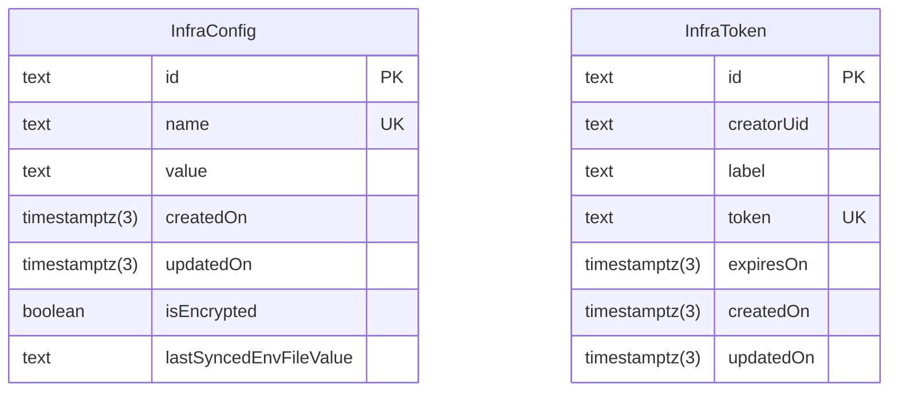

<!-- Generated by diagram-regenerator. Edit descriptions, not this file. -->
# Hoppscotch backend database (generated demo)

**23 tables · 171 columns** · source `hoppscotch/hoppscotch@63273f8 packages/hoppscotch-backend/prisma/migrations` · fingerprint `c5677efbd8f8`

> Regenerate with `diagram-regen generate`. Column descriptions come from database comments and the descriptions file; rows marked _draft_ were suggested automatically and await review.

## Contents

- [Entity-relationship diagram](#entity-relationship-diagram)
  - [Users and sign-in](#users-and-sign-in)
  - [Teams](#teams)
  - [Personal workspace](#personal-workspace)
  - [Mock servers and publishing](#mock-servers-and-publishing)
  - [Instance admin](#instance-admin)
- [Tables](#tables): [Account](#account) · [InfraConfig](#infraconfig) · [InfraToken](#infratoken) · [InvitedUsers](#invitedusers) · [MockServer](#mockserver) · [MockServerActivity](#mockserveractivity) · [MockServerLog](#mockserverlog) · [PersonalAccessToken](#personalaccesstoken) · [PublishedDocs](#publisheddocs) · [Shortcode](#shortcode) · [Team](#team) · [TeamCollection](#teamcollection) · [TeamEnvironment](#teamenvironment) · [TeamInvitation](#teaminvitation) · [TeamMember](#teammember) · [TeamRequest](#teamrequest) · [User](#user) · [UserCollection](#usercollection) · [UserEnvironment](#userenvironment) · [UserHistory](#userhistory) · [UserRequest](#userrequest) · [UserSettings](#usersettings) · [VerificationToken](#verificationtoken)
- [Enums](#enums)

## Entity-relationship diagram

_23 tables: the overview shows key columns only. Every column is listed under [Tables](#tables)._

```mermaid
erDiagram
    Account {
        text id PK
        text userId FK
    }
    InfraConfig {
        text id PK
        text name UK
    }
    InfraToken {
        text id PK
        text token UK
    }
    InvitedUsers {
        text adminUid FK
        text inviteeEmail UK
    }
    MockServer {
        text id PK
        text subdomain UK
        text creatorUid FK
    }
    MockServerActivity {
        text id PK
        text mockServerID FK
    }
    MockServerLog {
        text id PK
        text mockServerID FK
    }
    PersonalAccessToken {
        text id PK
        text userUid FK
        text token UK
    }
    PublishedDocs {
        text id PK
    }
    Shortcode {
        text id PK
        text creatorUid FK
    }
    Team {
        text id PK
    }
    TeamCollection {
        text id PK
        text parentID FK
        text teamID FK
    }
    TeamEnvironment {
        text id PK
        text teamID FK
    }
    TeamInvitation {
        text id PK
        text teamID FK
    }
    TeamMember {
        text id PK
        text teamID FK
    }
    TeamRequest {
        text id PK
        text collectionID FK
        text teamID FK
    }
    User {
        text uid PK
        text email UK
    }
    UserCollection {
        text id PK
        text parentID FK
        text userUid FK
    }
    UserEnvironment {
        text id PK
        text userUid FK
    }
    UserHistory {
        text id PK
        text userUid FK
    }
    UserRequest {
        text id PK
        text collectionID FK
        text userUid FK
    }
    UserSettings {
        text id PK
        text userUid FK, UK
    }
    VerificationToken {
        text token UK
        text userUid FK
    }
    User ||..o{ Account : "userId"
    User ||..o{ InvitedUsers : "adminUid"
    User |o..o{ MockServer : "creatorUid"
    MockServer ||..o{ MockServerActivity : "mockServerID"
    MockServer ||..o{ MockServerLog : "mockServerID"
    User ||..o{ PersonalAccessToken : "userUid"
    User |o..o{ Shortcode : "creatorUid"
    TeamCollection |o..o{ TeamCollection : "parentID"
    Team ||..o{ TeamCollection : "teamID"
    Team ||..o{ TeamEnvironment : "teamID"
    Team ||..o{ TeamInvitation : "teamID"
    Team ||..o{ TeamMember : "teamID"
    TeamCollection ||..o{ TeamRequest : "collectionID"
    Team ||..o{ TeamRequest : "teamID"
    UserCollection |o..o{ UserCollection : "parentID"
    User ||..o{ UserCollection : "userUid"
    User ||..o{ UserEnvironment : "userUid"
    User ||..o{ UserHistory : "userUid"
    UserCollection ||..o{ UserRequest : "collectionID"
    User ||..o{ UserRequest : "userUid"
    User ||..o| UserSettings : "userUid"
    User ||..o{ VerificationToken : "userUid"
```

### Users and sign-in

### Teams

### Personal workspace

### Mock servers and publishing

### Instance admin

## Tables

### Account

| Column | Type | Nullable | Default | Keys | Description |
| --- | --- | --- | --- | --- | --- |
| `id` | `text` |  |  | PK |  |
| `userId` | `text` |  |  | FK → [User](#user).`uid` (cascade on delete) |  |
| `provider` | `text` |  |  |  |  |
| `providerAccountId` | `text` |  |  |  |  |
| `providerRefreshToken` | `text` | yes |  |  |  |
| `providerAccessToken` | `text` | yes |  |  |  |
| `providerScope` | `text` | yes |  |  |  |
| `loggedIn` | `timestamptz(3)` |  | `current_timestamp` |  |  |

**Indexes:** unique `Account_provider_providerAccountId_key` (`provider`, `providerAccountId`)

### InfraConfig

| Column | Type | Nullable | Default | Keys | Description |
| --- | --- | --- | --- | --- | --- |
| `id` | `text` |  |  | PK |  |
| `name` | `text` |  |  | UK |  |
| `value` | `text` | yes |  |  |  |
| `createdOn` | `timestamptz(3)` |  | `current_timestamp` |  |  |
| `updatedOn` | `timestamptz(3)` |  |  |  |  |
| `isEncrypted` | `boolean` |  | `false` |  |  |
| `lastSyncedEnvFileValue` | `text` | yes |  |  |  |

**Indexes:** unique `InfraConfig_name_key` (`name`)

### InfraToken

| Column | Type | Nullable | Default | Keys | Description |
| --- | --- | --- | --- | --- | --- |
| `id` | `text` |  |  | PK |  |
| `creatorUid` | `text` |  |  |  |  |
| `label` | `text` |  |  |  |  |
| `token` | `text` |  |  | UK |  |
| `expiresOn` | `timestamptz(3)` | yes |  |  |  |
| `createdOn` | `timestamptz(3)` |  | `current_timestamp` |  |  |
| `updatedOn` | `timestamptz(3)` |  | `current_timestamp` |  |  |

**Indexes:** unique `InfraToken_token_key` (`token`)

### InvitedUsers

| Column | Type | Nullable | Default | Keys | Description |
| --- | --- | --- | --- | --- | --- |
| `adminUid` | `text` |  |  | FK → [User](#user).`uid` (cascade on delete) |  |
| `adminEmail` | `text` |  |  |  |  |
| `inviteeEmail` | `text` |  |  | UK |  |
| `invitedOn` | `timestamptz(3)` |  | `current_timestamp` |  |  |

**Indexes:** unique `InvitedUsers_inviteeEmail_key` (`inviteeEmail`)

### MockServer

| Column | Type | Nullable | Default | Keys | Description |
| --- | --- | --- | --- | --- | --- |
| `id` | `text` |  |  | PK |  |
| `name` | `text` |  |  |  |  |
| `subdomain` | `text` |  |  | UK |  |
| `creatorUid` | `text` | yes |  | FK → [User](#user).`uid` (set null on delete) |  |
| `collectionID` | `text` |  |  |  |  |
| `workspaceType` | `workspacetype` |  |  |  |  |
| `workspaceID` | `text` |  |  |  |  |
| `delayInMs` | `integer` |  | `0` |  |  |
| `isPublic` | `boolean` |  | `true` |  |  |
| `isActive` | `boolean` |  | `true` |  |  |
| `hitCount` | `integer` |  | `0` |  |  |
| `lastHitAt` | `timestamptz(3)` | yes |  |  |  |
| `createdOn` | `timestamptz(3)` |  | `current_timestamp` |  |  |
| `updatedOn` | `timestamptz(3)` |  |  |  |  |
| `deletedAt` | `timestamptz(3)` | yes |  |  |  |

**Indexes:** unique `MockServer_subdomain_key` (`subdomain`)

**Referenced by:** [MockServerActivity](#mockserveractivity).`mockServerID` · [MockServerLog](#mockserverlog).`mockServerID`

### MockServerActivity

| Column | Type | Nullable | Default | Keys | Description |
| --- | --- | --- | --- | --- | --- |
| `id` | `text` |  |  | PK |  |
| `mockServerID` | `text` |  |  | FK → [MockServer](#mockserver).`id` (cascade on delete) |  |
| `action` | `mockserveraction` |  |  |  |  |
| `performedBy` | `text` | yes |  |  |  |
| `performedAt` | `timestamptz(3)` |  | `current_timestamp` |  |  |

**Indexes:** `MockServerActivity_mockServerID_idx` (`mockServerID`)

### MockServerLog

| Column | Type | Nullable | Default | Keys | Description |
| --- | --- | --- | --- | --- | --- |
| `id` | `text` |  |  | PK |  |
| `mockServerID` | `text` |  |  | FK → [MockServer](#mockserver).`id` (cascade on delete) |  |
| `requestMethod` | `text` |  |  |  |  |
| `requestPath` | `text` |  |  |  |  |
| `requestHeaders` | `jsonb` |  |  |  |  |
| `requestBody` | `jsonb` | yes |  |  |  |
| `requestQuery` | `jsonb` | yes |  |  |  |
| `responseStatus` | `integer` |  |  |  |  |
| `responseHeaders` | `jsonb` |  |  |  |  |
| `responseBody` | `jsonb` | yes |  |  |  |
| `responseTime` | `integer` |  |  |  |  |
| `ipAddress` | `text` | yes |  |  |  |
| `userAgent` | `text` | yes |  |  |  |
| `executedAt` | `timestamptz(3)` |  | `current_timestamp` |  |  |

**Indexes:** `MockServerLog_mockServerID_idx` (`mockServerID`) · `MockServerLog_mockServerID_executedAt_idx` (`mockServerID`, `executedAt`)

### PersonalAccessToken

| Column | Type | Nullable | Default | Keys | Description |
| --- | --- | --- | --- | --- | --- |
| `id` | `text` |  |  | PK |  |
| `userUid` | `text` |  |  | FK → [User](#user).`uid` (cascade on delete) |  |
| `label` | `text` |  |  |  |  |
| `token` | `text` |  |  | UK |  |
| `expiresOn` | `timestamptz(3)` | yes |  |  |  |
| `createdOn` | `timestamptz(3)` |  | `current_timestamp` |  |  |
| `updatedOn` | `timestamptz(3)` |  |  |  |  |

**Indexes:** unique `PersonalAccessToken_token_key` (`token`)

### PublishedDocs

| Column | Type | Nullable | Default | Keys | Description |
| --- | --- | --- | --- | --- | --- |
| `id` | `text` |  |  | PK |  |
| `title` | `text` |  |  |  |  |
| `collectionID` | `text` |  |  |  |  |
| `creatorUid` | `text` |  |  |  |  |
| `version` | `text` |  |  |  |  |
| `autoSync` | `boolean` |  |  |  |  |
| `documentTree` | `jsonb` | yes |  |  |  |
| `workspaceType` | `workspacetype` |  |  |  |  |
| `workspaceID` | `text` |  |  |  |  |
| `metadata` | `jsonb` | yes |  |  |  |
| `createdOn` | `timestamptz(3)` |  | `current_timestamp` |  |  |
| `updatedOn` | `timestamptz(3)` |  |  |  |  |
| `slug` | `text` |  |  |  |  |
| `environmentID` | `text` | yes |  |  |  |
| `environmentName` | `text` | yes |  |  |  |
| `environmentVariables` | `jsonb` | yes |  |  |  |

**Indexes:** unique `PublishedDocs_slug_version_key` (`slug`, `version`) · `PublishedDocs_collectionID_idx` (`collectionID`)

### Shortcode

| Column | Type | Nullable | Default | Keys | Description |
| --- | --- | --- | --- | --- | --- |
| `id` | `text` |  |  | PK |  |
| `request` | `jsonb` |  |  |  |  |
| `creatorUid` | `text` | yes |  | FK → [User](#user).`uid` (set null on delete) |  |
| `createdOn` | `timestamptz(3)` |  | `current_timestamp` |  |  |
| `embedProperties` | `jsonb` | yes |  |  |  |
| `updatedOn` | `timestamptz(3)` |  | `current_timestamp` |  |  |

**Indexes:** unique `Shortcode_id_creatorUid_key` (`id`, `creatorUid`)

### Team

| Column | Type | Nullable | Default | Keys | Description |
| --- | --- | --- | --- | --- | --- |
| `id` | `text` |  |  | PK |  |
| `name` | `text` |  |  |  |  |

**Referenced by:** [TeamCollection](#teamcollection).`teamID` · [TeamEnvironment](#teamenvironment).`teamID` · [TeamInvitation](#teaminvitation).`teamID` · [TeamMember](#teammember).`teamID` · [TeamRequest](#teamrequest).`teamID`

### TeamCollection

| Column | Type | Nullable | Default | Keys | Description |
| --- | --- | --- | --- | --- | --- |
| `id` | `text` |  |  | PK |  |
| `parentID` | `text` | yes |  | FK → [TeamCollection](#teamcollection).`id` (cascade on delete) |  |
| `teamID` | `text` |  |  | FK → [Team](#team).`id` (cascade on delete) |  |
| `title` | `text` |  |  |  |  |
| `orderIndex` | `integer` |  |  |  |  |
| `createdOn` | `timestamptz(3)` |  | `current_timestamp` |  |  |
| `updatedOn` | `timestamptz(3)` |  |  |  |  |
| `data` | `jsonb` | yes |  |  |  |

**Indexes:** unique `TeamCollection_teamID_parentID_orderIndex_key` (`teamID`, `parentID`, `orderIndex`) · `TeamCollection_title_trgm_idx` (`title gin_trgm_ops`)

**Referenced by:** [TeamCollection](#teamcollection).`parentID` · [TeamRequest](#teamrequest).`collectionID`

### TeamEnvironment

| Column | Type | Nullable | Default | Keys | Description |
| --- | --- | --- | --- | --- | --- |
| `id` | `text` |  |  | PK |  |
| `teamID` | `text` |  |  | FK → [Team](#team).`id` (cascade on delete) |  |
| `name` | `text` |  |  |  |  |
| `variables` | `jsonb` |  |  |  |  |

### TeamInvitation

| Column | Type | Nullable | Default | Keys | Description |
| --- | --- | --- | --- | --- | --- |
| `id` | `text` |  |  | PK |  |
| `teamID` | `text` |  |  | FK → [Team](#team).`id` (cascade on delete) |  |
| `creatorUid` | `text` |  |  |  |  |
| `inviteeEmail` | `text` |  |  |  |  |
| `inviteeRole` | `teamaccessrole` |  |  |  |  |

**Indexes:** unique `TeamInvitation_teamID_inviteeEmail_key` (`teamID`, `inviteeEmail`) · `TeamInvitation_teamID_idx` (`teamID`)

### TeamMember

| Column | Type | Nullable | Default | Keys | Description |
| --- | --- | --- | --- | --- | --- |
| `id` | `text` |  |  | PK |  |
| `role` | `teamaccessrole` |  |  |  |  |
| `userUid` | `text` |  |  |  |  |
| `teamID` | `text` |  |  | FK → [Team](#team).`id` (cascade on delete) |  |

**Indexes:** unique `TeamMember_teamID_userUid_key` (`teamID`, `userUid`)

### TeamRequest

| Column | Type | Nullable | Default | Keys | Description |
| --- | --- | --- | --- | --- | --- |
| `id` | `text` |  |  | PK |  |
| `collectionID` | `text` |  |  | FK → [TeamCollection](#teamcollection).`id` (cascade on delete) |  |
| `teamID` | `text` |  |  | FK → [Team](#team).`id` (cascade on delete) |  |
| `title` | `text` |  |  |  |  |
| `request` | `jsonb` |  |  |  |  |
| `orderIndex` | `integer` |  |  |  |  |
| `createdOn` | `timestamptz(3)` |  | `current_timestamp` |  |  |
| `updatedOn` | `timestamptz(3)` |  |  |  |  |
| `mockExamples` | `jsonb` | yes |  |  |  |

**Indexes:** unique `TeamRequest_teamID_collectionID_orderIndex_key` (`teamID`, `collectionID`, `orderIndex`) · `idx_mock_examples_team_requests_gin` (`mockExamples`) · `TeamRequest_title_trgm_idx` (`title gin_trgm_ops`)

### User

| Column | Type | Nullable | Default | Keys | Description |
| --- | --- | --- | --- | --- | --- |
| `uid` | `text` |  |  | PK |  |
| `displayName` | `text` | yes |  |  |  |
| `email` | `text` | yes |  | UK |  |
| `photoURL` | `text` | yes |  |  |  |
| `isAdmin` | `boolean` |  | `false` |  |  |
| `refreshToken` | `text` | yes |  |  |  |
| `currentRESTSession` | `jsonb` | yes |  |  |  |
| `currentGQLSession` | `jsonb` | yes |  |  |  |
| `createdOn` | `timestamptz(3)` |  | `current_timestamp` |  |  |
| `lastLoggedOn` | `timestamptz(3)` | yes |  |  |  |
| `lastActiveOn` | `timestamptz(3)` | yes |  |  |  |

**Indexes:** unique `User_email_key` (`email`)

**Referenced by:** [Account](#account).`userId` · [InvitedUsers](#invitedusers).`adminUid` · [MockServer](#mockserver).`creatorUid` · [PersonalAccessToken](#personalaccesstoken).`userUid` · [Shortcode](#shortcode).`creatorUid` · [UserCollection](#usercollection).`userUid` · [UserEnvironment](#userenvironment).`userUid` · [UserHistory](#userhistory).`userUid` · [UserRequest](#userrequest).`userUid` · [UserSettings](#usersettings).`userUid` · [VerificationToken](#verificationtoken).`userUid`

### UserCollection

| Column | Type | Nullable | Default | Keys | Description |
| --- | --- | --- | --- | --- | --- |
| `id` | `text` |  |  | PK |  |
| `parentID` | `text` | yes |  | FK → [UserCollection](#usercollection).`id` (cascade on delete) |  |
| `userUid` | `text` |  |  | FK → [User](#user).`uid` (cascade on delete) |  |
| `title` | `text` |  |  |  |  |
| `orderIndex` | `integer` |  |  |  |  |
| `type` | `reqtype` |  |  |  |  |
| `createdOn` | `timestamptz(3)` |  | `current_timestamp` |  |  |
| `updatedOn` | `timestamptz(3)` |  |  |  |  |
| `data` | `jsonb` | yes |  |  |  |

**Indexes:** unique `UserCollection_userUid_parentID_orderIndex_key` (`userUid`, `parentID`, `orderIndex`)

**Referenced by:** [UserCollection](#usercollection).`parentID` · [UserRequest](#userrequest).`collectionID`

### UserEnvironment

| Column | Type | Nullable | Default | Keys | Description |
| --- | --- | --- | --- | --- | --- |
| `id` | `text` |  |  | PK |  |
| `userUid` | `text` |  |  | FK → [User](#user).`uid` (cascade on delete) |  |
| `name` | `text` | yes |  |  |  |
| `variables` | `jsonb` |  |  |  |  |
| `isGlobal` | `boolean` |  |  |  |  |

### UserHistory

| Column | Type | Nullable | Default | Keys | Description |
| --- | --- | --- | --- | --- | --- |
| `id` | `text` |  |  | PK |  |
| `userUid` | `text` |  |  | FK → [User](#user).`uid` (cascade on delete) |  |
| `reqType` | `reqtype` |  |  |  |  |
| `request` | `jsonb` |  |  |  |  |
| `responseMetadata` | `jsonb` |  |  |  |  |
| `isStarred` | `boolean` |  |  |  |  |
| `executedOn` | `timestamptz(3)` |  | `current_timestamp` |  |  |

### UserRequest

| Column | Type | Nullable | Default | Keys | Description |
| --- | --- | --- | --- | --- | --- |
| `id` | `text` |  |  | PK |  |
| `collectionID` | `text` |  |  | FK → [UserCollection](#usercollection).`id` (cascade on delete) |  |
| `userUid` | `text` |  |  | FK → [User](#user).`uid` (cascade on delete) |  |
| `title` | `text` |  |  |  |  |
| `request` | `jsonb` |  |  |  |  |
| `type` | `reqtype` |  |  |  |  |
| `orderIndex` | `integer` |  |  |  |  |
| `createdOn` | `timestamptz(3)` |  | `current_timestamp` |  |  |
| `updatedOn` | `timestamptz(3)` |  |  |  |  |
| `mockExamples` | `jsonb` | yes |  |  |  |

**Indexes:** unique `UserRequest_userUid_collectionID_orderIndex_key` (`userUid`, `collectionID`, `orderIndex`) · `idx_mock_examples_user_requests_gin` (`mockExamples`)

### UserSettings

| Column | Type | Nullable | Default | Keys | Description |
| --- | --- | --- | --- | --- | --- |
| `id` | `text` |  |  | PK |  |
| `userUid` | `text` |  |  | FK → [User](#user).`uid` (cascade on delete) UK |  |
| `properties` | `jsonb` |  |  |  |  |
| `updatedOn` | `timestamptz(3)` |  |  |  |  |

**Indexes:** unique `UserSettings_userUid_key` (`userUid`)

### VerificationToken

| Column | Type | Nullable | Default | Keys | Description |
| --- | --- | --- | --- | --- | --- |
| `deviceIdentifier` | `text` |  |  |  |  |
| `token` | `text` |  |  | UK |  |
| `userUid` | `text` |  |  | FK → [User](#user).`uid` (cascade on delete) |  |
| `expiresOn` | `timestamptz(3)` |  |  |  |  |

**Indexes:** unique `VerificationToken_deviceIdentifier_token_key` (`deviceIdentifier`, `token`) · unique `VerificationToken_token_key` (`token`)

## Enums

| Enum | Values |
| --- | --- |
| `MockServerAction` | `CREATED`, `DELETED`, `ACTIVATED`, `DEACTIVATED` |
| `ReqType` | `REST`, `GQL` |
| `TeamAccessRole` | `OWNER`, `VIEWER`, `EDITOR` |
| `WorkspaceType` | `USER`, `TEAM` |
