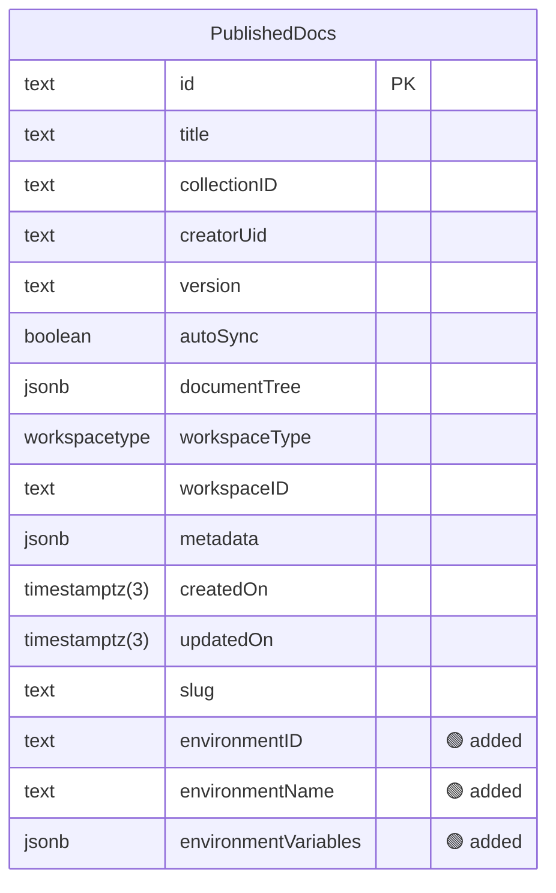

### 🗺️ hoppscotch: what `20260209063744_published_doc_environment/migration.sql` changes

**3 changes across 1 table** · 🟢 3 safe

| | Change | Detail |
| --- | --- | --- |
| 🟢 | Column `PublishedDocs.environmentID` added | text |
| 🟢 | Column `PublishedDocs.environmentName` added | text |
| 🟢 | Column `PublishedDocs.environmentVariables` added | jsonb |

Diagram of the changed tables

🟢 added · 🔴 removed · 🟡 changed · unmarked columns are unchanged

Generated by `python examples/oss/build.py` from [hoppscotch/hoppscotch@63273f8](https://github.com/hoppscotch/hoppscotch/tree/63273f8e599e73f0fb38c0739314e8d46b6bc83d/packages/hoppscotch-backend/prisma/migrations): the schema before `20260209063744_published_doc_environment/migration.sql` compared with the schema after it (1 later migration changes no tables).
