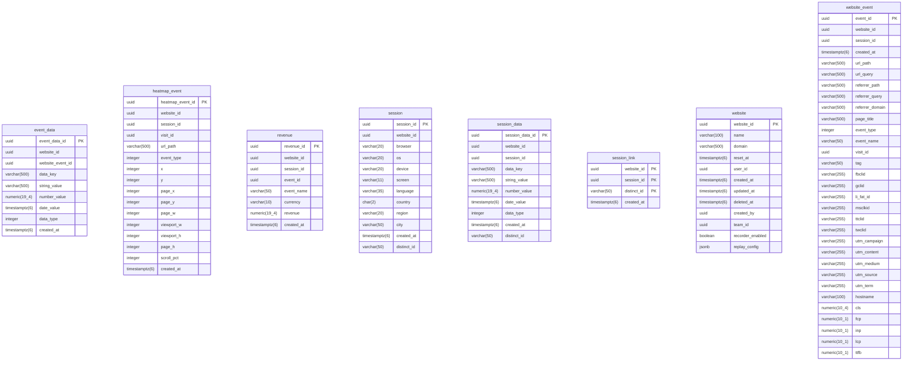
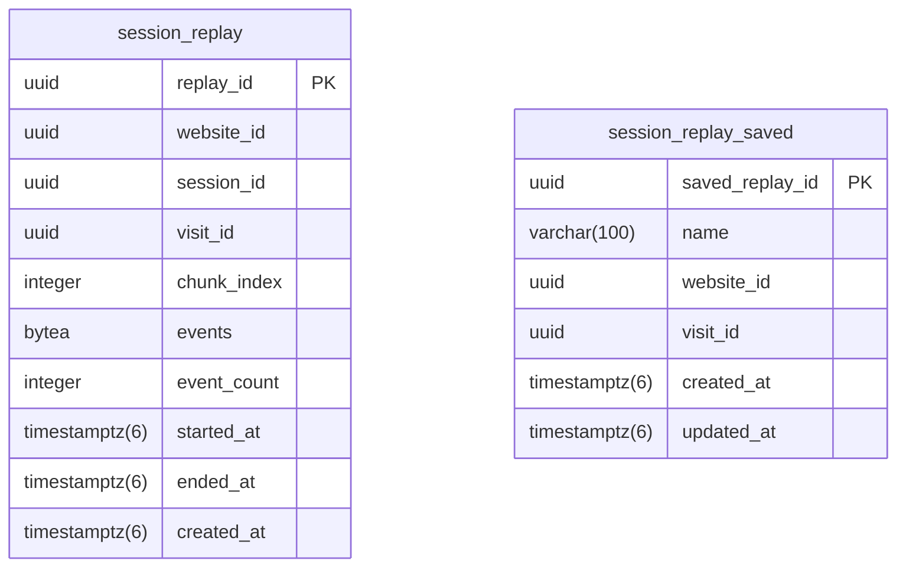
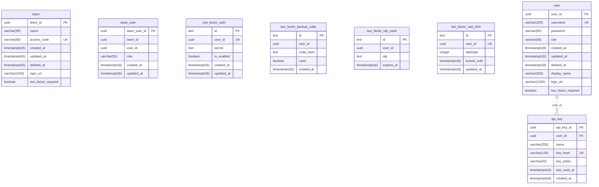

<!-- Generated by diagram-regenerator. Edit descriptions, not this file. -->
# Umami database (generated demo)

**26 tables · 229 columns** · source `umami-software/umami@ec0ff50 prisma/migrations` · fingerprint `c4cf36c7aea3`

> Regenerate with `diagram-regen generate`. Column descriptions come from database comments and the descriptions file; rows marked _draft_ were suggested automatically and await review.

## Contents

- [Entity-relationship diagram](#entity-relationship-diagram)
  - [Tracking](#tracking)
  - [Session replay](#session-replay)
  - [Accounts and security](#accounts-and-security)
  - [Sharing and reports](#sharing-and-reports)
- [Tables](#tables): [annotation](#annotation) · [api_key](#api_key) · [app_setting](#app_setting) · [board](#board) · [event_data](#event_data) · [heatmap_event](#heatmap_event) · [link](#link) · [pixel](#pixel) · [report](#report) · [revenue](#revenue) · [segment](#segment) · [session](#session) · [session_data](#session_data) · [session_link](#session_link) · [session_replay](#session_replay) · [session_replay_saved](#session_replay_saved) · [share](#share) · [team](#team) · [team_user](#team_user) · [two_factor_auth](#two_factor_auth) · [two_factor_backup_code](#two_factor_backup_code) · [two_factor_otp_used](#two_factor_otp_used) · [two_factor_rate_limit](#two_factor_rate_limit) · [user](#user) · [website](#website) · [website_event](#website_event)

## Entity-relationship diagram

_26 tables: the overview shows key columns only. Every column is listed under [Tables](#tables)._

```mermaid
erDiagram
    annotation {
        uuid annotation_id PK
    }
    api_key {
        uuid api_key_id PK
        uuid user_id FK
        varchar(128) key_hash UK
    }
    app_setting {
        text key PK
    }
    board {
        uuid board_id PK
    }
    event_data {
        uuid event_data_id PK
    }
    heatmap_event {
        uuid heatmap_event_id PK
    }
    link {
        uuid link_id PK
        varchar(100) slug UK
    }
    pixel {
        uuid pixel_id PK
        varchar(100) slug UK
    }
    report {
        uuid report_id PK
    }
    revenue {
        uuid revenue_id PK
    }
    segment {
        uuid segment_id PK
    }
    session {
        uuid session_id PK
    }
    session_data {
        uuid session_data_id PK
    }
    session_link {
        uuid website_id PK
        uuid session_id PK
        varchar(50) distinct_id PK
    }
    session_replay {
        uuid replay_id PK
    }
    session_replay_saved {
        uuid saved_replay_id PK
    }
    share {
        uuid share_id PK
        varchar(100) slug UK
    }
    team {
        uuid team_id PK
        varchar(50) access_code UK
    }
    team_user {
        uuid team_user_id PK
    }
    two_factor_auth {
        text id PK
        uuid user_id UK
    }
    two_factor_backup_code {
        text id PK
    }
    two_factor_otp_used {
        text id PK
    }
    two_factor_rate_limit {
        text id PK
        uuid user_id UK
    }
    user {
        uuid user_id PK
        varchar(255) username UK
    }
    website {
        uuid website_id PK
    }
    website_event {
        uuid event_id PK
    }
    user ||..o{ api_key : "user_id"
```

### Tracking

### Session replay

### Accounts and security

### Sharing and reports

```mermaid
erDiagram
    annotation {
        uuid annotation_id PK
        uuid website_id
        uuid user_id
        timestamptz(6) date
        boolean all_day
        varchar(500) note
        timestamptz(6) created_at
        timestamptz(6) updated_at
    }
    app_setting {
        text key PK
        text value
    }
    board {
        uuid board_id PK
        varchar(50) type
        varchar(200) name
        varchar(500) description
        jsonb parameters
        uuid user_id
        uuid team_id
        timestamptz(6) created_at
        timestamptz(6) updated_at
    }
    link {
        uuid link_id PK
        varchar(100) name
        varchar(500) url
        varchar(100) slug UK
        uuid user_id
        uuid team_id
        timestamptz(6) created_at
        timestamptz(6) updated_at
        timestamptz(6) deleted_at
    }
    pixel {
        uuid pixel_id PK
        varchar(100) name
        varchar(100) slug UK
        uuid user_id
        uuid team_id
        timestamptz(6) created_at
        timestamptz(6) updated_at
        timestamptz(6) deleted_at
    }
    report {
        uuid report_id PK
        uuid user_id
        uuid website_id
        varchar(50) type
        varchar(200) name
        varchar(500) description
        jsonb parameters
        timestamptz(6) created_at
        timestamptz(6) updated_at
    }
    segment {
        uuid segment_id PK
        uuid website_id
        varchar(50) type
        varchar(200) name
        jsonb parameters
        timestamptz(6) created_at
        timestamptz(6) updated_at
    }
    share {
        uuid share_id PK
        uuid entity_id
        varchar(200) name
        integer share_type
        varchar(100) slug UK
        jsonb parameters
        timestamptz(6) created_at
        timestamptz(6) updated_at
    }
```

## Tables

### annotation

| Column | Type | Nullable | Default | Keys | Description |
| --- | --- | --- | --- | --- | --- |
| `annotation_id` | `uuid` |  |  | PK |  |
| `website_id` | `uuid` |  |  |  |  |
| `user_id` | `uuid` | yes |  |  |  |
| `date` | `timestamptz(6)` |  |  |  |  |
| `all_day` | `boolean` |  | `true` |  |  |
| `note` | `varchar(500)` |  |  |  |  |
| `created_at` | `timestamptz(6)` | yes | `current_timestamp` |  |  |
| `updated_at` | `timestamptz(6)` | yes |  |  |  |

**Indexes:** `annotation_website_id_date_idx` (`website_id`, `date`)

### api_key

| Column | Type | Nullable | Default | Keys | Description |
| --- | --- | --- | --- | --- | --- |
| `api_key_id` | `uuid` |  |  | PK |  |
| `user_id` | `uuid` |  |  | FK → [user](#user).`user_id` (cascade on delete) |  |
| `name` | `varchar(255)` |  |  |  |  |
| `key_hash` | `varchar(128)` |  |  | UK |  |
| `key_prefix` | `varchar(20)` |  |  |  |  |
| `last_used_at` | `timestamptz(6)` | yes |  |  |  |
| `created_at` | `timestamptz(6)` | yes | `current_timestamp` |  |  |

**Indexes:** unique `api_key_key_hash_key` (`key_hash`) · `api_key_user_id_idx` (`user_id`)

### app_setting

| Column | Type | Nullable | Default | Keys | Description |
| --- | --- | --- | --- | --- | --- |
| `key` | `text` |  |  | PK |  |
| `value` | `text` |  |  |  |  |

### board

| Column | Type | Nullable | Default | Keys | Description |
| --- | --- | --- | --- | --- | --- |
| `board_id` | `uuid` |  |  | PK |  |
| `type` | `varchar(50)` |  |  |  |  |
| `name` | `varchar(200)` |  |  |  |  |
| `description` | `varchar(500)` |  |  |  |  |
| `parameters` | `jsonb` |  |  |  |  |
| `user_id` | `uuid` | yes |  |  |  |
| `team_id` | `uuid` | yes |  |  |  |
| `created_at` | `timestamptz(6)` | yes | `current_timestamp` |  |  |
| `updated_at` | `timestamptz(6)` | yes |  |  |  |

**Indexes:** `board_created_at_idx` (`created_at`) · `board_team_id_idx` (`team_id`) · `board_user_id_idx` (`user_id`)

### event_data

| Column | Type | Nullable | Default | Keys | Description |
| --- | --- | --- | --- | --- | --- |
| `event_data_id` | `uuid` |  |  | PK |  |
| `website_id` | `uuid` |  |  |  |  |
| `website_event_id` | `uuid` |  |  |  |  |
| `data_key` | `varchar(500)` |  |  |  |  |
| `string_value` | `varchar(500)` | yes |  |  |  |
| `number_value` | `numeric(19,4)` | yes |  |  |  |
| `date_value` | `timestamptz(6)` | yes |  |  |  |
| `data_type` | `integer` |  |  |  |  |
| `created_at` | `timestamptz(6)` | yes | `current_timestamp` |  |  |

**Indexes:** `event_data_created_at_idx` (`created_at`) · `event_data_website_event_id_idx` (`website_event_id`) · `event_data_website_id_idx` (`website_id`) · `event_data_website_id_created_at_idx` (`website_id`, `created_at`) · `event_data_website_id_created_at_data_key_idx` (`website_id`, `created_at`, `data_key`)

### heatmap_event

| Column | Type | Nullable | Default | Keys | Description |
| --- | --- | --- | --- | --- | --- |
| `heatmap_event_id` | `uuid` |  |  | PK |  |
| `website_id` | `uuid` |  |  |  |  |
| `session_id` | `uuid` |  |  |  |  |
| `visit_id` | `uuid` |  |  |  |  |
| `url_path` | `varchar(500)` |  |  |  |  |
| `event_type` | `integer` |  |  |  |  |
| `x` | `integer` | yes |  |  |  |
| `y` | `integer` | yes |  |  |  |
| `page_x` | `integer` | yes |  |  |  |
| `page_y` | `integer` | yes |  |  |  |
| `page_w` | `integer` | yes |  |  |  |
| `viewport_w` | `integer` | yes |  |  |  |
| `viewport_h` | `integer` | yes |  |  |  |
| `page_h` | `integer` | yes |  |  |  |
| `scroll_pct` | `integer` | yes |  |  |  |
| `created_at` | `timestamptz(6)` |  | `current_timestamp` |  |  |

**Indexes:** `heatmap_event_visit_id_idx` (`visit_id`) · `heatmap_event_website_id_idx` (`website_id`) · `heatmap_event_website_id_created_at_idx` (`website_id`, `created_at`) · `heatmap_event_website_id_url_path_event_type_created_at_idx` (`website_id`, `url_path`, `event_type`, `created_at`)

### link

| Column | Type | Nullable | Default | Keys | Description |
| --- | --- | --- | --- | --- | --- |
| `link_id` | `uuid` |  |  | PK |  |
| `name` | `varchar(100)` |  |  |  |  |
| `url` | `varchar(500)` |  |  |  |  |
| `slug` | `varchar(100)` |  |  | UK |  |
| `user_id` | `uuid` | yes |  |  |  |
| `team_id` | `uuid` | yes |  |  |  |
| `created_at` | `timestamptz(6)` | yes | `current_timestamp` |  |  |
| `updated_at` | `timestamptz(6)` | yes |  |  |  |
| `deleted_at` | `timestamptz(6)` | yes |  |  |  |

**Indexes:** unique `link_slug_key` (`slug`) · `link_created_at_idx` (`created_at`) · `link_slug_idx` (`slug`) · `link_team_id_idx` (`team_id`) · `link_user_id_idx` (`user_id`)

### pixel

| Column | Type | Nullable | Default | Keys | Description |
| --- | --- | --- | --- | --- | --- |
| `pixel_id` | `uuid` |  |  | PK |  |
| `name` | `varchar(100)` |  |  |  |  |
| `slug` | `varchar(100)` |  |  | UK |  |
| `user_id` | `uuid` | yes |  |  |  |
| `team_id` | `uuid` | yes |  |  |  |
| `created_at` | `timestamptz(6)` | yes | `current_timestamp` |  |  |
| `updated_at` | `timestamptz(6)` | yes |  |  |  |
| `deleted_at` | `timestamptz(6)` | yes |  |  |  |

**Indexes:** unique `pixel_slug_key` (`slug`) · `pixel_created_at_idx` (`created_at`) · `pixel_slug_idx` (`slug`) · `pixel_team_id_idx` (`team_id`) · `pixel_user_id_idx` (`user_id`)

### report

| Column | Type | Nullable | Default | Keys | Description |
| --- | --- | --- | --- | --- | --- |
| `report_id` | `uuid` |  |  | PK |  |
| `user_id` | `uuid` |  |  |  |  |
| `website_id` | `uuid` |  |  |  |  |
| `type` | `varchar(50)` |  |  |  |  |
| `name` | `varchar(200)` |  |  |  |  |
| `description` | `varchar(500)` |  |  |  |  |
| `parameters` | `jsonb` |  |  |  |  |
| `created_at` | `timestamptz(6)` | yes | `current_timestamp` |  |  |
| `updated_at` | `timestamptz(6)` | yes |  |  |  |

**Indexes:** `report_name_idx` (`name`) · `report_type_idx` (`type`) · `report_user_id_idx` (`user_id`) · `report_website_id_idx` (`website_id`)

### revenue

| Column | Type | Nullable | Default | Keys | Description |
| --- | --- | --- | --- | --- | --- |
| `revenue_id` | `uuid` |  |  | PK |  |
| `website_id` | `uuid` |  |  |  |  |
| `session_id` | `uuid` |  |  |  |  |
| `event_id` | `uuid` |  |  |  |  |
| `event_name` | `varchar(50)` |  |  |  |  |
| `currency` | `varchar(10)` |  |  |  |  |
| `revenue` | `numeric(19,4)` | yes |  |  |  |
| `created_at` | `timestamptz(6)` | yes | `current_timestamp` |  |  |

**Indexes:** `revenue_session_id_idx` (`session_id`) · `revenue_website_id_idx` (`website_id`) · `revenue_website_id_created_at_idx` (`website_id`, `created_at`) · `revenue_website_id_session_id_created_at_idx` (`website_id`, `session_id`, `created_at`)

### segment

| Column | Type | Nullable | Default | Keys | Description |
| --- | --- | --- | --- | --- | --- |
| `segment_id` | `uuid` |  |  | PK |  |
| `website_id` | `uuid` |  |  |  |  |
| `type` | `varchar(50)` |  |  |  |  |
| `name` | `varchar(200)` |  |  |  |  |
| `parameters` | `jsonb` |  |  |  |  |
| `created_at` | `timestamptz(6)` | yes | `current_timestamp` |  |  |
| `updated_at` | `timestamptz(6)` | yes |  |  |  |

**Indexes:** `segment_website_id_idx` (`website_id`)

### session

| Column | Type | Nullable | Default | Keys | Description |
| --- | --- | --- | --- | --- | --- |
| `session_id` | `uuid` |  |  | PK |  |
| `website_id` | `uuid` |  |  |  |  |
| `browser` | `varchar(20)` | yes |  |  |  |
| `os` | `varchar(20)` | yes |  |  |  |
| `device` | `varchar(20)` | yes |  |  |  |
| `screen` | `varchar(11)` | yes |  |  |  |
| `language` | `varchar(35)` | yes |  |  |  |
| `country` | `char(2)` | yes |  |  |  |
| `region` | `varchar(20)` | yes |  |  |  |
| `city` | `varchar(50)` | yes |  |  |  |
| `created_at` | `timestamptz(6)` | yes | `current_timestamp` |  |  |
| `distinct_id` | `varchar(50)` | yes |  |  |  |

**Indexes:** `session_created_at_idx` (`created_at`) · `session_website_id_idx` (`website_id`) · `session_website_id_created_at_idx` (`website_id`, `created_at`) · `session_website_id_created_at_browser_idx` (`website_id`, `created_at`, `browser`) · `session_website_id_created_at_city_idx` (`website_id`, `created_at`, `city`) · `session_website_id_created_at_country_idx` (`website_id`, `created_at`, `country`) · `session_website_id_created_at_device_idx` (`website_id`, `created_at`, `device`) · `session_website_id_created_at_language_idx` (`website_id`, `created_at`, `language`) · `session_website_id_created_at_os_idx` (`website_id`, `created_at`, `os`) · `session_website_id_created_at_region_idx` (`website_id`, `created_at`, `region`) · `session_website_id_created_at_screen_idx` (`website_id`, `created_at`, `screen`)

### session_data

| Column | Type | Nullable | Default | Keys | Description |
| --- | --- | --- | --- | --- | --- |
| `session_data_id` | `uuid` |  |  | PK |  |
| `website_id` | `uuid` |  |  |  |  |
| `session_id` | `uuid` |  |  |  |  |
| `data_key` | `varchar(500)` |  |  |  |  |
| `string_value` | `varchar(500)` | yes |  |  |  |
| `number_value` | `numeric(19,4)` | yes |  |  |  |
| `date_value` | `timestamptz(6)` | yes |  |  |  |
| `data_type` | `integer` |  |  |  |  |
| `created_at` | `timestamptz(6)` | yes | `current_timestamp` |  |  |
| `distinct_id` | `varchar(50)` | yes |  |  |  |

**Indexes:** unique `session_data_session_id_data_key_key` (`session_id`, `data_key`) · `session_data_created_at_idx` (`created_at`) · `session_data_session_id_idx` (`session_id`) · `session_data_session_id_created_at_idx` (`session_id`, `created_at`) · `session_data_website_id_idx` (`website_id`) · `session_data_website_id_created_at_data_key_idx` (`website_id`, `created_at`, `data_key`)

### session_link

| Column | Type | Nullable | Default | Keys | Description |
| --- | --- | --- | --- | --- | --- |
| `website_id` | `uuid` |  |  | PK |  |
| `session_id` | `uuid` |  |  | PK |  |
| `distinct_id` | `varchar(50)` |  |  | PK |  |
| `created_at` | `timestamptz(6)` | yes | `current_timestamp` |  |  |

**Indexes:** `session_link_website_id_session_id_idx` (`website_id`, `session_id`)

### session_replay

| Column | Type | Nullable | Default | Keys | Description |
| --- | --- | --- | --- | --- | --- |
| `replay_id` | `uuid` |  |  | PK |  |
| `website_id` | `uuid` |  |  |  |  |
| `session_id` | `uuid` |  |  |  |  |
| `visit_id` | `uuid` |  |  |  |  |
| `chunk_index` | `integer` |  |  |  |  |
| `events` | `bytea` |  |  |  |  |
| `event_count` | `integer` |  |  |  |  |
| `started_at` | `timestamptz(6)` |  |  |  |  |
| `ended_at` | `timestamptz(6)` |  |  |  |  |
| `created_at` | `timestamptz(6)` | yes | `current_timestamp` |  |  |

**Indexes:** `session_replay_session_id_idx` (`session_id`) · `session_replay_session_id_chunk_index_idx` (`session_id`, `chunk_index`) · `session_replay_visit_id_idx` (`visit_id`) · `session_replay_website_id_idx` (`website_id`) · `session_replay_website_id_created_at_idx` (`website_id`, `created_at`) · `session_replay_website_id_session_id_idx` (`website_id`, `session_id`) · `session_replay_website_id_visit_id_idx` (`website_id`, `visit_id`)

### session_replay_saved

| Column | Type | Nullable | Default | Keys | Description |
| --- | --- | --- | --- | --- | --- |
| `saved_replay_id` | `uuid` |  |  | PK |  |
| `name` | `varchar(100)` |  |  |  |  |
| `website_id` | `uuid` |  |  |  |  |
| `visit_id` | `uuid` |  |  |  |  |
| `created_at` | `timestamptz(6)` | yes | `current_timestamp` |  |  |
| `updated_at` | `timestamptz(6)` | yes |  |  |  |

**Indexes:** unique `session_replay_saved_website_id_visit_id_key` (`website_id`, `visit_id`) · `session_replay_saved_visit_id_idx` (`visit_id`) · `session_replay_saved_website_id_idx` (`website_id`) · `session_replay_saved_website_id_created_at_idx` (`website_id`, `created_at`)

### share

| Column | Type | Nullable | Default | Keys | Description |
| --- | --- | --- | --- | --- | --- |
| `share_id` | `uuid` |  |  | PK |  |
| `entity_id` | `uuid` |  |  |  |  |
| `name` | `varchar(200)` |  |  |  |  |
| `share_type` | `integer` |  |  |  |  |
| `slug` | `varchar(100)` |  |  | UK |  |
| `parameters` | `jsonb` |  |  |  |  |
| `created_at` | `timestamptz(6)` | yes | `current_timestamp` |  |  |
| `updated_at` | `timestamptz(6)` | yes |  |  |  |

**Indexes:** unique `share_slug_key` (`slug`) · `share_entity_id_idx` (`entity_id`)

### team

| Column | Type | Nullable | Default | Keys | Description |
| --- | --- | --- | --- | --- | --- |
| `team_id` | `uuid` |  |  | PK |  |
| `name` | `varchar(50)` |  |  |  |  |
| `access_code` | `varchar(50)` | yes |  | UK |  |
| `created_at` | `timestamptz(6)` | yes | `current_timestamp` |  |  |
| `updated_at` | `timestamptz(6)` | yes |  |  |  |
| `deleted_at` | `timestamptz(6)` | yes |  |  |  |
| `logo_url` | `varchar(2183)` | yes |  |  |  |
| `two_factor_required` | `boolean` |  | `false` |  |  |

**Indexes:** unique `team_access_code_key` (`access_code`) · `team_access_code_idx` (`access_code`)

### team_user

| Column | Type | Nullable | Default | Keys | Description |
| --- | --- | --- | --- | --- | --- |
| `team_user_id` | `uuid` |  |  | PK |  |
| `team_id` | `uuid` |  |  |  |  |
| `user_id` | `uuid` |  |  |  |  |
| `role` | `varchar(50)` |  |  |  |  |
| `created_at` | `timestamptz(6)` | yes | `current_timestamp` |  |  |
| `updated_at` | `timestamptz(6)` | yes |  |  |  |

**Indexes:** `team_user_team_id_idx` (`team_id`) · `team_user_user_id_idx` (`user_id`)

### two_factor_auth

| Column | Type | Nullable | Default | Keys | Description |
| --- | --- | --- | --- | --- | --- |
| `id` | `text` |  |  | PK |  |
| `user_id` | `uuid` |  |  | UK |  |
| `secret` | `text` |  |  |  |  |
| `is_enabled` | `boolean` |  | `false` |  |  |
| `created_at` | `timestamptz(6)` |  | `current_timestamp` |  |  |
| `updated_at` | `timestamptz(6)` |  |  |  |  |

**Indexes:** unique `two_factor_auth_user_id_key` (`user_id`)

### two_factor_backup_code

| Column | Type | Nullable | Default | Keys | Description |
| --- | --- | --- | --- | --- | --- |
| `id` | `text` |  |  | PK |  |
| `user_id` | `uuid` |  |  |  |  |
| `code_hash` | `text` |  |  |  |  |
| `used` | `boolean` |  | `false` |  |  |
| `created_at` | `timestamptz(6)` |  | `current_timestamp` |  |  |

**Indexes:** `two_factor_backup_code_user_id_idx` (`user_id`)

### two_factor_otp_used

| Column | Type | Nullable | Default | Keys | Description |
| --- | --- | --- | --- | --- | --- |
| `id` | `text` |  |  | PK |  |
| `user_id` | `uuid` |  |  |  |  |
| `otp` | `text` |  |  |  |  |
| `expires_at` | `timestamptz(6)` |  |  |  |  |

**Indexes:** unique `two_factor_otp_used_user_id_otp_key` (`user_id`, `otp`)

### two_factor_rate_limit

| Column | Type | Nullable | Default | Keys | Description |
| --- | --- | --- | --- | --- | --- |
| `id` | `text` |  |  | PK |  |
| `user_id` | `uuid` |  |  | UK |  |
| `attempts` | `integer` |  | `0` |  |  |
| `locked_until` | `timestamptz(6)` | yes |  |  |  |
| `updated_at` | `timestamptz(6)` |  |  |  |  |

**Indexes:** unique `two_factor_rate_limit_user_id_key` (`user_id`)

### user

| Column | Type | Nullable | Default | Keys | Description |
| --- | --- | --- | --- | --- | --- |
| `user_id` | `uuid` |  |  | PK |  |
| `username` | `varchar(255)` |  |  | UK |  |
| `password` | `varchar(60)` |  |  |  |  |
| `role` | `varchar(50)` |  |  |  |  |
| `created_at` | `timestamptz(6)` | yes | `current_timestamp` |  |  |
| `updated_at` | `timestamptz(6)` | yes |  |  |  |
| `deleted_at` | `timestamptz(6)` | yes |  |  |  |
| `display_name` | `varchar(255)` | yes |  |  |  |
| `logo_url` | `varchar(2183)` | yes |  |  |  |
| `two_factor_required` | `boolean` |  | `false` |  |  |

**Indexes:** unique `user_username_key` (`username`)

**Referenced by:** [api_key](#api_key).`user_id`

### website

| Column | Type | Nullable | Default | Keys | Description |
| --- | --- | --- | --- | --- | --- |
| `website_id` | `uuid` |  |  | PK |  |
| `name` | `varchar(100)` |  |  |  |  |
| `domain` | `varchar(500)` | yes |  |  |  |
| `reset_at` | `timestamptz(6)` | yes |  |  |  |
| `user_id` | `uuid` | yes |  |  |  |
| `created_at` | `timestamptz(6)` | yes | `current_timestamp` |  |  |
| `updated_at` | `timestamptz(6)` | yes |  |  |  |
| `deleted_at` | `timestamptz(6)` | yes |  |  |  |
| `created_by` | `uuid` | yes |  |  |  |
| `team_id` | `uuid` | yes |  |  |  |
| `recorder_enabled` | `boolean` |  | `false` |  |  |
| `replay_config` | `jsonb` | yes |  |  |  |

**Indexes:** `website_created_at_idx` (`created_at`) · `website_created_by_idx` (`created_by`) · `website_team_id_idx` (`team_id`) · `website_user_id_idx` (`user_id`)

### website_event

| Column | Type | Nullable | Default | Keys | Description |
| --- | --- | --- | --- | --- | --- |
| `event_id` | `uuid` |  |  | PK |  |
| `website_id` | `uuid` |  |  |  |  |
| `session_id` | `uuid` |  |  |  |  |
| `created_at` | `timestamptz(6)` | yes | `current_timestamp` |  |  |
| `url_path` | `varchar(500)` |  |  |  |  |
| `url_query` | `varchar(500)` | yes |  |  |  |
| `referrer_path` | `varchar(500)` | yes |  |  |  |
| `referrer_query` | `varchar(500)` | yes |  |  |  |
| `referrer_domain` | `varchar(500)` | yes |  |  |  |
| `page_title` | `varchar(500)` | yes |  |  |  |
| `event_type` | `integer` |  | `1` |  |  |
| `event_name` | `varchar(50)` | yes |  |  |  |
| `visit_id` | `uuid` |  |  |  |  |
| `tag` | `varchar(50)` | yes |  |  |  |
| `fbclid` | `varchar(255)` | yes |  |  |  |
| `gclid` | `varchar(255)` | yes |  |  |  |
| `li_fat_id` | `varchar(255)` | yes |  |  |  |
| `msclkid` | `varchar(255)` | yes |  |  |  |
| `ttclid` | `varchar(255)` | yes |  |  |  |
| `twclid` | `varchar(255)` | yes |  |  |  |
| `utm_campaign` | `varchar(255)` | yes |  |  |  |
| `utm_content` | `varchar(255)` | yes |  |  |  |
| `utm_medium` | `varchar(255)` | yes |  |  |  |
| `utm_source` | `varchar(255)` | yes |  |  |  |
| `utm_term` | `varchar(255)` | yes |  |  |  |
| `hostname` | `varchar(100)` | yes |  |  |  |
| `cls` | `numeric(10,4)` | yes |  |  |  |
| `fcp` | `numeric(10,1)` | yes |  |  |  |
| `inp` | `numeric(10,1)` | yes |  |  |  |
| `lcp` | `numeric(10,1)` | yes |  |  |  |
| `ttfb` | `numeric(10,1)` | yes |  |  |  |

**Indexes:** `website_event_created_at_idx` (`created_at`) · `website_event_session_id_idx` (`session_id`) · `website_event_visit_id_idx` (`visit_id`) · `website_event_website_id_idx` (`website_id`) · `website_event_website_id_created_at_idx` (`website_id`, `created_at`) · `website_event_website_id_created_at_event_name_idx` (`website_id`, `created_at`, `event_name`) · `website_event_website_id_created_at_hostname_idx` (`website_id`, `created_at`, `hostname`) · `website_event_website_id_created_at_page_title_idx` (`website_id`, `created_at`, `page_title`) · `website_event_website_id_created_at_referrer_domain_idx` (`website_id`, `created_at`, `referrer_domain`) · `website_event_website_id_created_at_tag_idx` (`website_id`, `created_at`, `tag`) · `website_event_website_id_created_at_url_path_idx` (`website_id`, `created_at`, `url_path`) · `website_event_website_id_created_at_url_query_idx` (`website_id`, `created_at`, `url_query`) · `website_event_website_id_session_id_created_at_idx` (`website_id`, `session_id`, `created_at`) · `website_event_website_id_visit_id_created_at_idx` (`website_id`, `visit_id`, `created_at`)
