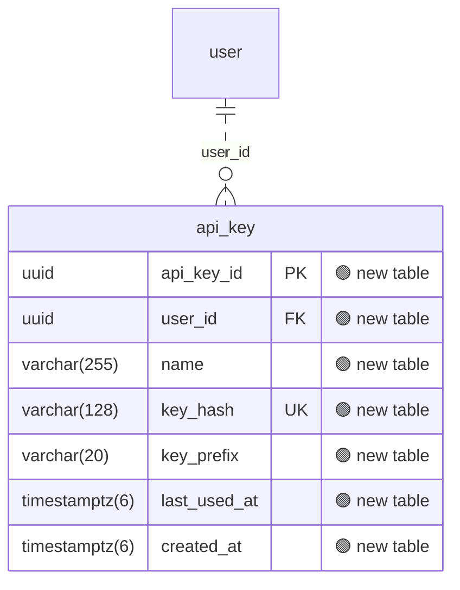

### 🗺️ umami: what `26_add_api_key/migration.sql` changes

**1 change across 1 table** · 🟢 1 safe

| | Change | Detail |
| --- | --- | --- |
| 🟢 | Table `api_key` added |  |

Diagram of the changed tables

🟢 added · 🔴 removed · 🟡 changed · unmarked columns are unchanged

Generated by `python examples/oss/build.py` from [umami-software/umami@ec0ff50](https://github.com/umami-software/umami/tree/ec0ff50388c264ed8ce46f00967e92f7e71476ae/prisma/migrations): the schema before `26_add_api_key/migration.sql` compared with the schema after it.
