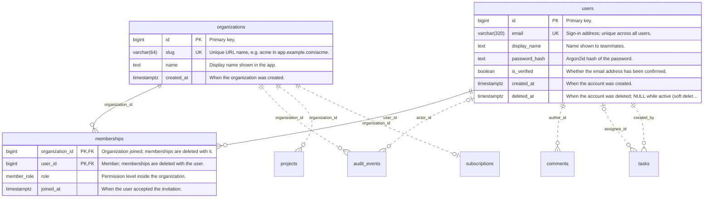
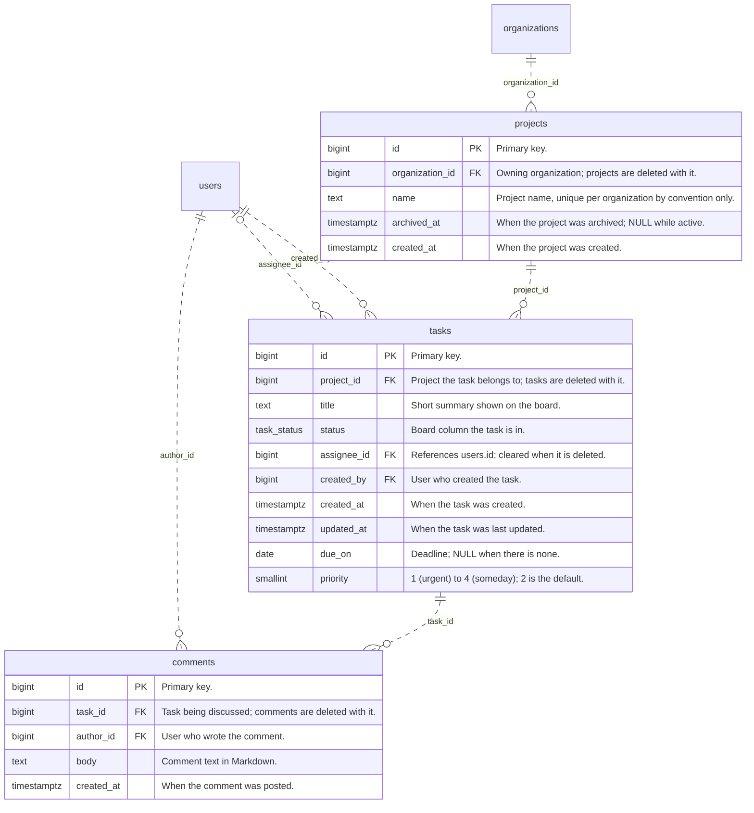

<!-- Generated by diagram-regenerator. Edit descriptions, not this file. -->
# Taskboard database

**9 tables · 52 columns** · source `db/migrations` · fingerprint `93ff77df6c18`

> Regenerate with `diagram-regen generate`. Column descriptions come from database comments and the descriptions file; rows marked _draft_ were suggested automatically and await review.

## Contents

- [Entity-relationship diagram](#entity-relationship-diagram)
  - [Accounts](#accounts)
  - [Work](#work)
  - [Billing](#billing)
- [Tables](#tables): [audit_events](#audit_events) · [comments](#comments) · [invoices](#invoices) · [memberships](#memberships) · [organizations](#organizations) · [projects](#projects) · [subscriptions](#subscriptions) · [tasks](#tasks) · [users](#users)
- [Enums](#enums)

## Entity-relationship diagram

```mermaid
erDiagram
    audit_events {
        bigint id PK "Primary key."
        bigint organization_id FK "Organization the event belongs to; events are deleted with…"
        bigint actor_id FK "User who performed the action; NULL for system jobs or dele…"
        text action "Dotted event name, e.g. member.invited or project.archived."
        jsonb payload "Event-specific details as JSON; never contains secrets."
        timestamptz created_at "When the action happened."
    }
    comments {
        bigint id PK "Primary key."
        bigint task_id FK "Task being discussed; comments are deleted with it."
        bigint author_id FK "User who wrote the comment."
        text body "Comment text in Markdown."
        timestamptz created_at "When the comment was posted."
    }
    invoices {
        bigint id PK "Primary key."
        bigint subscription_id FK "Subscription this invoice bills."
        integer amount_cents "Total charged, in the smallest unit of the currency."
        char(3) currency "ISO 4217 currency code."
        timestamptz issued_at "When Stripe issued the invoice."
        timestamptz paid_at "When payment succeeded; NULL while unpaid."
    }
    memberships {
        bigint organization_id PK, FK "Organization joined; memberships are deleted with it."
        bigint user_id PK, FK "Member; memberships are deleted with the user."
        member_role role "Permission level inside the organization."
        timestamptz joined_at "When the user accepted the invitation."
    }
    organizations {
        bigint id PK "Primary key."
        varchar(64) slug UK "Unique URL name, e.g. acme in app.example.com/acme."
        text name "Display name shown in the app."
        timestamptz created_at "When the organization was created."
    }
    projects {
        bigint id PK "Primary key."
        bigint organization_id FK "Owning organization; projects are deleted with it."
        text name "Project name, unique per organization by convention only."
        timestamptz archived_at "When the project was archived; NULL while active."
        timestamptz created_at "When the project was created."
    }
    subscriptions {
        bigint id PK "Primary key."
        bigint organization_id FK, UK "Subscribing organization."
        text stripe_customer_id "Stripe customer ID (cus_...)."
        integer seats "Number of paid seats."
        date renews_on "Next renewal date; NULL when the plan is cancelled."
    }
    tasks {
        bigint id PK "Primary key."
        bigint project_id FK "Project the task belongs to; tasks are deleted with it."
        text title "Short summary shown on the board."
        task_status status "Board column the task is in."
        bigint assignee_id FK "References users.id; cleared when it is deleted."
        bigint created_by FK "User who created the task."
        timestamptz created_at "When the task was created."
        timestamptz updated_at "When the task was last updated."
        date due_on "Deadline; NULL when there is none."
        smallint priority "1 (urgent) to 4 (someday); 2 is the default."
    }
    users {
        bigint id PK "Primary key."
        varchar(320) email UK "Sign-in address; unique across all users."
        text display_name "Name shown to teammates."
        text password_hash "Argon2id hash of the password."
        boolean is_verified "Whether the email address has been confirmed."
        timestamptz created_at "When the account was created."
        timestamptz deleted_at "When the account was deleted; NULL while active (soft delet…"
    }
    users |o..o{ audit_events : "actor_id"
    organizations ||..o{ audit_events : "organization_id"
    users ||..o{ comments : "author_id"
    tasks ||..o{ comments : "task_id"
    subscriptions ||..o{ invoices : "subscription_id"
    organizations ||--o{ memberships : "organization_id"
    users ||--o{ memberships : "user_id"
    organizations ||..o{ projects : "organization_id"
    organizations ||..o| subscriptions : "organization_id"
    users |o..o{ tasks : "assignee_id"
    users ||..o{ tasks : "created_by"
    projects ||..o{ tasks : "project_id"
```

### Accounts

### Work

### Billing

```mermaid
erDiagram
    invoices {
        bigint id PK "Primary key."
        bigint subscription_id FK "Subscription this invoice bills."
        integer amount_cents "Total charged, in the smallest unit of the currency."
        char(3) currency "ISO 4217 currency code."
        timestamptz issued_at "When Stripe issued the invoice."
        timestamptz paid_at "When payment succeeded; NULL while unpaid."
    }
    subscriptions {
        bigint id PK "Primary key."
        bigint organization_id FK, UK "Subscribing organization."
        text stripe_customer_id "Stripe customer ID (cus_...)."
        integer seats "Number of paid seats."
        date renews_on "Next renewal date; NULL when the plan is cancelled."
    }
    organizations
    subscriptions ||..o{ invoices : "subscription_id"
    organizations ||..o| subscriptions : "organization_id"
```

## Tables

### audit_events

Append-only log of security-relevant actions, kept for 400 days.

| Column | Type | Nullable | Default | Keys | Description |
| --- | --- | --- | --- | --- | --- |
| `id` | `bigint` |  | auto-increment | PK | Primary key. |
| `organization_id` | `bigint` |  |  | FK → [organizations](#organizations).`id` (cascade on delete) | Organization the event belongs to; events are deleted with it. |
| `actor_id` | `bigint` | yes |  | FK → [users](#users).`id` (set null on delete) | User who performed the action; NULL for system jobs or deleted users. |
| `action` | `text` |  |  |  | Dotted event name, e.g. member.invited or project.archived. |
| `payload` | `jsonb` |  | `'{}'` |  | Event-specific details as JSON; never contains secrets. |
| `created_at` | `timestamptz` |  | `current_timestamp` |  | When the action happened. |

**Indexes:** `ix_audit_org_created` (`organization_id`, `created_at`)

### comments

Discussion on a task, newest last.

| Column | Type | Nullable | Default | Keys | Description |
| --- | --- | --- | --- | --- | --- |
| `id` | `bigint` |  | auto-increment | PK | Primary key. |
| `task_id` | `bigint` |  |  | FK → [tasks](#tasks).`id` (cascade on delete) | Task being discussed; comments are deleted with it. |
| `author_id` | `bigint` |  |  | FK → [users](#users).`id` | User who wrote the comment. |
| `body` | `text` |  |  |  | Comment text in Markdown. |
| `created_at` | `timestamptz` |  | `current_timestamp` |  | When the comment was posted. |

### invoices

One row per billing period, mirrored from Stripe.

| Column | Type | Nullable | Default | Keys | Description |
| --- | --- | --- | --- | --- | --- |
| `id` | `bigint` |  | auto-increment | PK | Primary key. |
| `subscription_id` | `bigint` |  |  | FK → [subscriptions](#subscriptions).`id` | Subscription this invoice bills. |
| `amount_cents` | `integer` |  |  |  | Total charged, in the smallest unit of the currency. |
| `currency` | `char(3)` |  | `'USD'` |  | ISO 4217 currency code. |
| `issued_at` | `timestamptz` |  | `current_timestamp` |  | When Stripe issued the invoice. |
| `paid_at` | `timestamptz` | yes |  |  | When payment succeeded; NULL while unpaid. |

### memberships

Which users belong to which organizations, and their role there.

| Column | Type | Nullable | Default | Keys | Description |
| --- | --- | --- | --- | --- | --- |
| `organization_id` | `bigint` |  |  | PK FK → [organizations](#organizations).`id` (cascade on delete) | Organization joined; memberships are deleted with it. |
| `user_id` | `bigint` |  |  | PK FK → [users](#users).`id` (cascade on delete) | Member; memberships are deleted with the user. |
| `role` | `member_role` |  | `'member'` |  | Permission level inside the organization. |
| `joined_at` | `timestamptz` |  | `current_timestamp` |  | When the user accepted the invitation. |

### organizations

Customer workspaces; every project and subscription belongs to one.

| Column | Type | Nullable | Default | Keys | Description |
| --- | --- | --- | --- | --- | --- |
| `id` | `bigint` |  | auto-increment | PK | Primary key. |
| `slug` | `varchar(64)` |  |  | UK | Unique URL name, e.g. acme in app.example.com/acme. |
| `name` | `text` |  |  |  | Display name shown in the app. |
| `created_at` | `timestamptz` |  | `current_timestamp` |  | When the organization was created. |

**Indexes:** unique `organizations_slug_key` (`slug`)

**Referenced by:** [audit_events](#audit_events).`organization_id` · [memberships](#memberships).`organization_id` · [projects](#projects).`organization_id` · [subscriptions](#subscriptions).`organization_id`

### projects

| Column | Type | Nullable | Default | Keys | Description |
| --- | --- | --- | --- | --- | --- |
| `id` | `bigint` |  | auto-increment | PK | Primary key. |
| `organization_id` | `bigint` |  |  | FK → [organizations](#organizations).`id` (cascade on delete) | Owning organization; projects are deleted with it. |
| `name` | `text` |  |  |  | Project name, unique per organization by convention only. |
| `archived_at` | `timestamptz` | yes |  |  | When the project was archived; NULL while active. |
| `created_at` | `timestamptz` |  | `current_timestamp` |  | When the project was created. |

**Indexes:** `ix_projects_org` (`organization_id`)

**Referenced by:** [tasks](#tasks).`project_id`

### subscriptions

The paid plan of an organization (at most one each).

| Column | Type | Nullable | Default | Keys | Description |
| --- | --- | --- | --- | --- | --- |
| `id` | `bigint` |  | auto-increment | PK | Primary key. |
| `organization_id` | `bigint` |  |  | FK → [organizations](#organizations).`id` UK | Subscribing organization. |
| `stripe_customer_id` | `text` |  |  |  | Stripe customer ID (cus_...). |
| `seats` | `integer` |  | `1` |  | Number of paid seats. |
| `renews_on` | `date` | yes |  |  | Next renewal date; NULL when the plan is cancelled. |

**Indexes:** unique `subscriptions_organization_id_key` (`organization_id`)

**Referenced by:** [invoices](#invoices).`subscription_id`

### tasks

Units of work inside a project.

| Column | Type | Nullable | Default | Keys | Description |
| --- | --- | --- | --- | --- | --- |
| `id` | `bigint` |  | auto-increment | PK | Primary key. |
| `project_id` | `bigint` |  |  | FK → [projects](#projects).`id` (cascade on delete) | Project the task belongs to; tasks are deleted with it. |
| `title` | `text` |  |  |  | Short summary shown on the board. |
| `status` | `task_status` |  | `'todo'` |  | Board column the task is in. |
| `assignee_id` | `bigint` | yes |  | FK → [users](#users).`id` (set null on delete) | _draft:_ References users.id; cleared when it is deleted. |
| `created_by` | `bigint` |  |  | FK → [users](#users).`id` | User who created the task. |
| `created_at` | `timestamptz` |  | `current_timestamp` |  | When the task was created. |
| `updated_at` | `timestamptz` |  | `current_timestamp` |  | _draft:_ When the task was last updated. |
| `due_on` | `date` | yes |  |  | Deadline; NULL when there is none. |
| `priority` | `smallint` |  | `2` |  | 1 (urgent) to 4 (someday); 2 is the default. |

**Indexes:** `ix_tasks_project_status` (`project_id`, `status`)

**Referenced by:** [comments](#comments).`task_id`

### users

People who can sign in.

| Column | Type | Nullable | Default | Keys | Description |
| --- | --- | --- | --- | --- | --- |
| `id` | `bigint` |  | auto-increment | PK | Primary key. |
| `email` | `varchar(320)` |  |  | UK | Sign-in address; unique across all users. |
| `display_name` | `text` |  |  |  | Name shown to teammates. |
| `password_hash` | `text` |  |  |  | Argon2id hash of the password. |
| `is_verified` | `boolean` |  | `false` |  | Whether the email address has been confirmed. |
| `created_at` | `timestamptz` |  | `current_timestamp` |  | When the account was created. |
| `deleted_at` | `timestamptz` | yes |  |  | When the account was deleted; NULL while active (soft delete). |

**Indexes:** unique `users_email_key` (`email`)

**Referenced by:** [audit_events](#audit_events).`actor_id` · [comments](#comments).`author_id` · [memberships](#memberships).`user_id` · [tasks](#tasks).`assignee_id` · [tasks](#tasks).`created_by`

## Enums

| Enum | Values |
| --- | --- |
| `member_role` | `owner`, `admin`, `member` |
| `task_status` | `todo`, `in_progress`, `done` |
