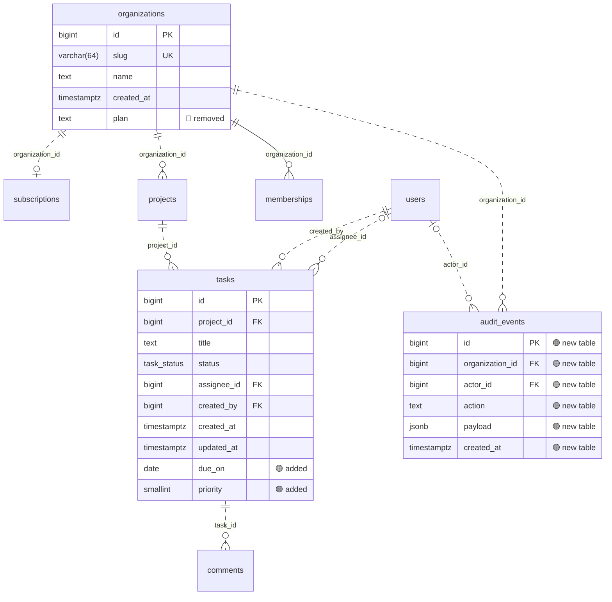

### 🗺️ Database schema changes

**4 changes across 3 tables** · 🔴 1 breaking · 🟢 3 safe

> [!WARNING]
> 1 change can break running code or lose data. Check the deploy order (expand → migrate → contract).

| | Change | Detail |
| --- | --- | --- |
| 🟢 | Table `audit_events` added |  |
| 🔴 | Column `organizations.plan` removed | was text not null default 'free' _its data is dropped and queries using it fail_ |
| 🟢 | Column `tasks.due_on` added | date |
| 🟢 | Column `tasks.priority` added | smallint not null default 2 |

Diagram of the changed tables

🟢 added · 🔴 removed · 🟡 changed · unmarked columns are unchanged

Compared migrations through `V3__billing.sql` with the result of adding `V4__due_dates_and_audit.sql`, by diagram-regenerator.
